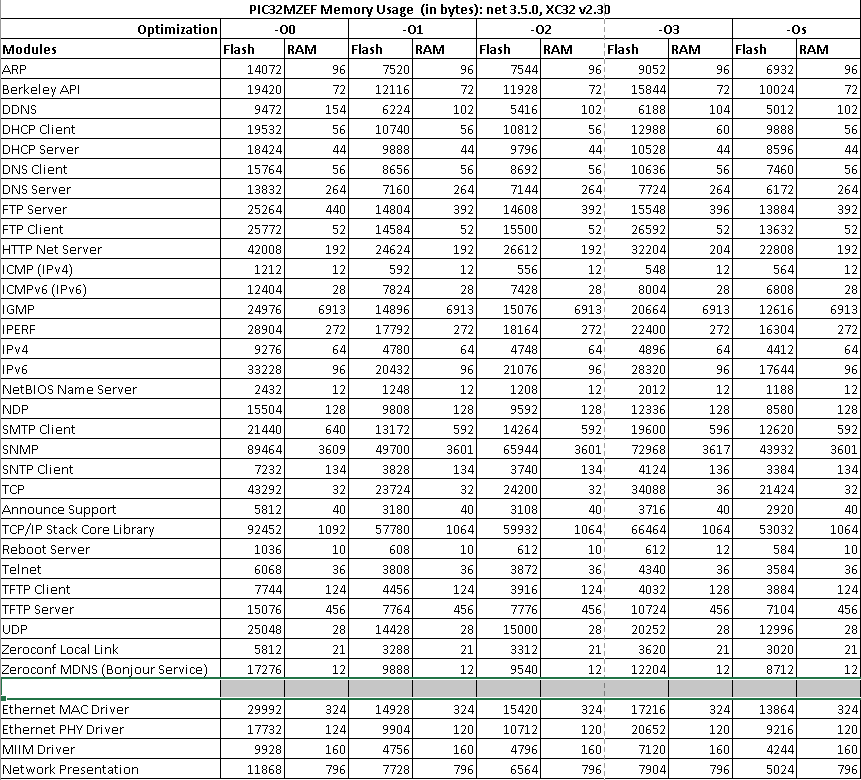
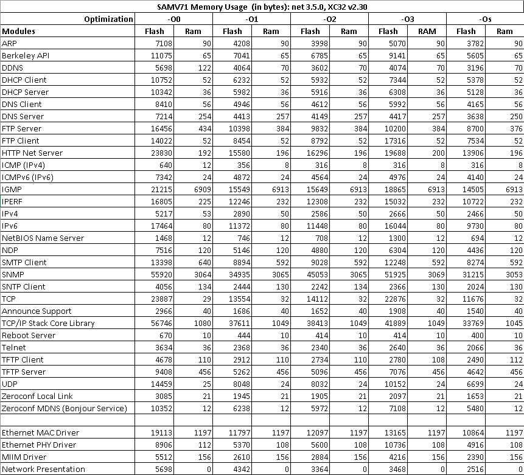
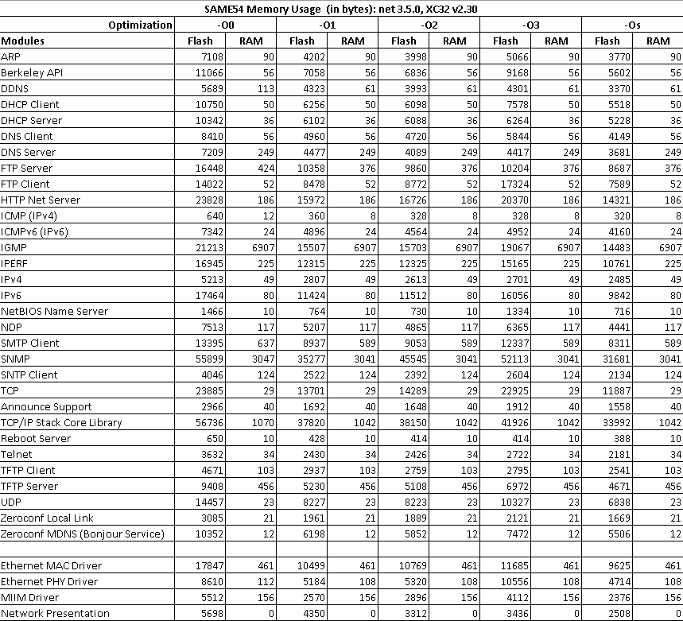
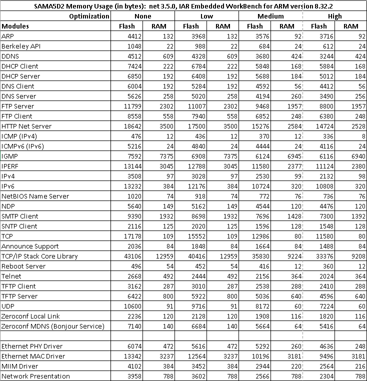
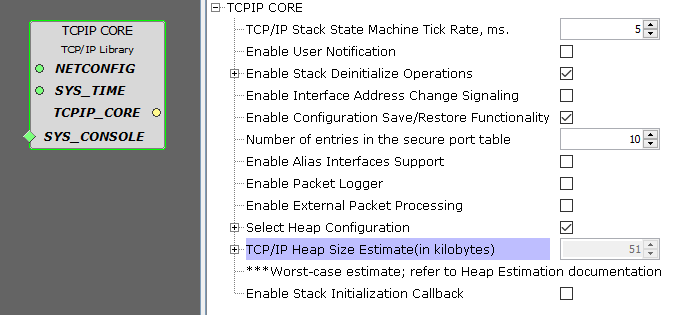
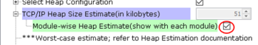

# MPLAB® Harmony TCP/IP Library

This distribution package contains a variety of TCP/IP firmware projects that demonstrate the capabilities of the MPLAB Harmony TCP/IP Stack. Each project describes its hardware setup and requirements. They are located in the net/apps folder.

This package also contains drivers for the Ethernet Controller \(MAC\) and supported external PHYs that can be connected to development boards, such as the LAN8720, LAN8740, KSZ8041, KSZ8061, etc. A PHY management and control MIIM driver supporting multiple clients is also supplied. All the drivers are located in the net/drivers folder.

The distribution package contains the NET\_PRES layer in the net/net/pres folder. This software module is used by the TCP/IP stack to establish encrypted connections \(TLS, DTLS\) with the use of an external service provider \(wolfSSL\).

Part of the distribution package is the TCP/IP Stack itself, containing the source files for all the modules that are part of the stack in the net/tcpip folder.

This distribution package contains various TCP/IP utilities \( MPFS generator, TCP/IP Discoverer, Microchip MIB Compiler\) that assist in the development and diagnostics of the TCP/IP applications. The utilities are located in the net/utilities folder. Note that third-party code - wolfSSL - is required for support of TLS and DTLS features.

Prior to using the TCP/IP demonstrations, it is recommended to review the MPLAB Harmony Release Notes \(release\_notes.md\) for any known issues. It is located in the net folder

**Introduction**

The MPLAB Harmony TCP/IP Stack provides a foundation for embedded network applications by handling most of the interaction required between the physical network port and the application. It includes modules for several commonly used application layers, including HTTP for serving web pages, SMTP for sending e-mails, SNMP for providing status and control, Telnet, TFTP, SNTP and many more. In addition, the stack includes light-weight and high-performance implementations of the TCP and UDP transport layers, as well as other supporting modules such as IPv4, IPv6, ICMPv4, ICMPv6, DHCPv4, DHCPv6, ARP, NDP, IGMP, DNS, etc.

**Flash and RAM Usage**

The following figures provide Flash and RAM usage information for the supported devices.

**Heap Usage Estimate**

The overall heap estimate is available with the 'TCPIP CORE' module configurations as shown below

The estimated heap size for TCP/IP is displayed in kilobytes. The TCP/IP heap size is derived by adding the heap estimation for each of the TCP/IP modules.

The module-wise heap estimation can be viewed with each TCP/IP modules by enabling ‘Module-wise Heap Estimate’ as shown below.

Remarks: Please note the following points regarding heap estimation,

-   This calculation provides an estimation close to "worst case" scenario.

-   Calculation does not consider all the run-time dynamic memory allocations/de-allocations.

-   Calculation does not consider the dynamic changes of the TCP and/or UDP socket buffer sizes.

-   The heap runtime tool gives a more accurate picture of heap usage. The run time tool is preferred as the static estimation of heap usage is approximative only.

-   The heap runtime tool can be used by enabling TCPIP\_STACK\_DRAM\_DEBUG\_ENABLE and TCPIP\_STACK\_DRAM\_TRACE\_ENABLE symbols. Then "heapinfo" command will give runtime heap usage.

-   It should be noted that even if an "out of memory" condition occurs at run time, the stack will behave graciously, and it will report the error, so that the operation can be re-tried.

**TCP/IP Stack Libraries/Modules, Drives and Layers**

TCP/IP Library includes the following Libraries/Modules, Drives and Layers:

-   **[Announce Module](GUID-2561DB16-7947-4C02-97DC-A0BFC17070C9.md)**  

-   **[ARP Module](GUID-3DCBF1EB-5623-4419-B244-DDD9B01704EE.md)**  

-   **[Berkeley Module](GUID-5F35C98C-EC8E-40FF-9B62-3B31D508F820.md)**  

-   **[DHCP Client Module](GUID-9356D53B-4F42-4E1E-B051-90F7C4D448E6.md)**  

-   **[DHCP Server Module](GUID-27C514CD-DE28-4215-BB75-6C8EA971E12E.md)**  

-   **[DHCP Server Module \(V2\)](GUID-EE292D18-2DE6-478E-AAE1-74C69A31459E.md)**  

-   **[DHCPv6 Module](GUID-0B7ADACD-E078-4FE5-BC6A-B7CABFE390D3.md)**  

-   **[DNS Module](GUID-D15C8F84-C30C-451F-8AB7-F8E62AD494C2.md)**  

-   **[DNS Server Module](GUID-987D1913-E20A-467D-9E57-DEC60B2EBE5D.md)**  

-   **[Dynamic DNS Module](GUID-2F39A35D-A741-49F8-BAA9-3B3C9B665486.md)**  

-   **[FTP Client Module](GUID-CE11EBFA-49BD-4D91-86C5-FFD24810B03C.md)**  

-   **[FTP Server Module](GUID-3FB7E1A3-E2CF-43D2-B8BB-8E306C170FF3.md)**  

-   **[HTTP Module](GUID-25A4CF50-2F8F-47E7-A90C-ABFA52814459.md)**  

-   **[HTTP Net Module](GUID-4EFEB885-ECF8-44B5-8F23-1D05952E1845.md)**  

-   **[ICMP Module](GUID-F3E078F7-6F1D-4D25-A999-F0F3E40A5971.md)**  

-   **[ICMPv6 Module](GUID-4C21649D-F597-4151-8607-5281DF9F04CC.md)**  

-   **[IGMP Module](GUID-DCB13BC6-B7A2-45CA-89E7-9474EAF05EFB.md)**  

-   **[Iperf Module](GUID-338BE6D4-6407-4074-804F-803059F7212B.md)**  

-   **[IPv4 Module](GUID-EA29E72F-4194-41F9-9F19-D8BBA00D62F2.md)**  

-   **[IPv6 Module](GUID-F2484EF9-7914-43EE-A5B7-4FFDC27C8135.md)**  

-   **[MAC Driver Module](GUID-0C1AF471-66D4-472F-84AF-212E9E18B21D.md)**  

-   **[Manager Module](GUID-B37C4F4C-DC2D-48D9-9909-AACBA987B57A.md)**  

-   **[NBNS Module](GUID-60817292-D657-471A-86CE-25D068933506.md)**  

-   **[NDP Module](GUID-5FBC9524-1287-42EB-B1A1-6F4C3C9980FD.md)**  

-   **[Reboot Module](GUID-FC6E0701-F309-47D1-9F2D-0253AADF48FC.md)**  

-   **[SMTP Module](GUID-2B9B587D-5018-4CA9-AA8D-2395A2D004A5.md)**  

-   **[SMTPC Module](GUID-1477C704-4A26-476C-8E70-7514FAF123F4.md)**  

-   **[SNMP Module](GUID-7764E81C-8FC9-4B3E-8830-255BDE678AA0.md)**  

-   **[SNTP Module](GUID-832A1C71-21E8-4386-BFCE-18B19538AC01.md)**  

-   **[TCP Module](GUID-9461917B-27CE-44ED-80DB-67D963896E8F.md)**  

-   **[Telnet Module](GUID-B0FCC6E9-74D8-443B-8F61-7317500EEFF3.md)**  

-   **[TFTP Client Module](GUID-5AE30EFB-7B7C-4B4E-8BCF-FAB8D8FB9A89.md)**  

-   **[TFTP Server Module](GUID-D76DC993-4CD3-4C65-92DB-14DEAB57BB27.md)**  

-   **[UDP Module](GUID-D2D8E9C8-0778-41E2-8F0B-194954B92250.md)**  

-   **[Zeroconf Module](GUID-1076C2EA-7DC5-419E-A3E7-BBA92CFF5CFB.md)**  

-   **[ENC28J60 Driver Library](GUID-58EA08F2-E38D-48FD-BD75-C2972C0EE761.md)**  

-   **[ENCx24J600 Driver Library](GUID-F35BADF5-5469-4970-B3C5-52AB1E2287AB.md)**  

-   **[Ethernet GMAC Driver Library](GUID-A24BDAD2-C63E-40B1-894D-1DC3CC6CB66A.md)**  

-   **[Ethernet MAC Driver Library](GUID-A4DC3D07-DDAD-4748-A855-304CA3439336.md)**  

-   **[Ethernet PHY Driver Library](GUID-F4DF749A-0F8C-4482-8661-C005A0BE0CF4.md)**  

-   **[MIIM Driver Library](GUID-A8906C8D-A608-4572-AE74-1E517DD2B0BE.md)**  

-   **[Networking Presentation Layer](GUID-75470E5B-2289-4F94-AE85-2BB7DF4C4F07.md)**  

