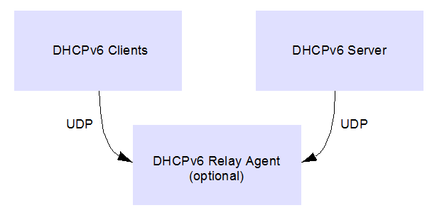

# DHCPv6 Module

The DHCPv6 client module will allow your application to dynamically obtain an IPv6 address from a DHCPv6 server. Additionally, the DHCPv6 client will get other parameters, such as DNS servers and the domain search list.

**Abstraction Model**

This module provides software abstraction of the DHCPv6 module existent in the TCP/IP Stack implementation. The DHCPv6 module works together with the IPv6 Stateless Address Auto-configuration protocol and provides stateful temporary/non-temporary \(IATA, IANA\) global addresses for the IPv6 host

**How the Library Works**

The IPv6 Dynamic Host Configuration Protocol \(DHCPv6\) is a standard networking protocol used to automatically allocate IPv6 addresses for hosts in a network.

The DHCPv6 server has a pool of IP addresses, which are leased for clients requesting them. The leases have a limited lifetime after which the hosts need to renew the lease or acquire a new one.

The DHCPv6 client module in the TCP/IP stack takes care of the communication with the DHCPv6 server and renewing the lease when the lifetime expires

**Library Interface**

|Name|Description|
|----|-----------|
|**Macros**||
|TCPIP\_DHCPV6\_CLIENT\_DUID\_TYPE|Default DUID type to be used by the client|
|TCPIP\_DHCPV6\_CLIENT\_PORT|Clients listen for DHCP messages on UDP port:|
|TCPIP\_DHCPV6\_DNS\_SERVERS\_NO|number of DNS servers to store from a DHCP server reply|
|TCPIP\_DHCPV6\_DOMAIN\_SEARCH\_LIST\_SIZE|space for the Domain Search List option - multiple of 16|
|TCPIP\_DHCPV6\_FORCED\_SERVER\_PREFERENCE|preference value that forces the server selection 8 bit value!|
|TCPIP\_DHCPV6\_IA\_FREE\_DESCRIPTORS\_NO|maximum number of free IA descriptors per client|
|TCPIP\_DHCPV6\_IA\_SOLICIT\_ADDRESS\_PREF\_LTIME|default lifetimes for the solicited addresses|
|TCPIP\_DHCPV6\_IA\_SOLICIT\_ADDRESS\_VALID\_LTIME|This is macro TCPIP\_DHCPV6\_IA\_SOLICIT\_ADDRESS\_VALID\_LTIME.|
|TCPIP\_DHCPV6\_IANA\_DEFAULT\_T1|default values for IANA T1, T2|
|TCPIP\_DHCPV6\_IANA\_DEFAULT\_T2|This is macro TCPIP\_DHCPV6\_IANA\_DEFAULT\_T2.|
|TCPIP\_DHCPV6\_IANA\_DESCRIPTORS\_NO|maximum number of IANA descriptors per client|
|TCPIP\_DHCPV6\_IANA\_SOLICIT\_ADDRESSES\_NO|default addresses for IANA in a solicit message|
|TCPIP\_DHCPV6\_IANA\_SOLICIT\_DEFAULT\_ADDRESS|default values for the IANA Solicit addresses irrelevant if TCPIP\_DHCPV6\_IANA\_SOLICIT\_ADDRESSES\_NO == 0 should be a value for each TCPIP\_DHCPV6\_IANA\_SOLICIT\_ADDRESSES\_NO|
|TCPIP\_DHCPV6\_IANA\_SOLICIT\_T1|default values for IANA T1, T2 in a solicit message|
|TCPIP\_DHCPV6\_IANA\_SOLICIT\_T2|This is macro TCPIP\_DHCPV6\_IANA\_SOLICIT\_T2.|
|TCPIP\_DHCPV6\_IATA\_DEFAULT\_T1|default values for IATA T1, T2 If 0, the timeout will be infinite \(0xffffffff\)|
|TCPIP\_DHCPV6\_IATA\_DEFAULT\_T2|This is macro TCPIP\_DHCPV6\_IATA\_DEFAULT\_T2.|
|TCPIP\_DHCPV6\_IATA\_DESCRIPTORS\_NO|maximum number of IATA descriptors per client|
|TCPIP\_DHCPV6\_IATA\_SOLICIT\_ADDRESSES\_NO|default addresses for IATA in a solicit message|
|TCPIP\_DHCPV6\_IATA\_SOLICIT\_DEFAULT\_ADDRESS|default values for the IANA Solicit addresses irrelevant if TCPIP\_DHCPV6\_IATA\_SOLICIT\_ADDRESSES\_NO == 0 should be a value for each TCPIP\_DHCPV6\_IATA\_SOLICIT\_ADDRESSES\_NO|
|TCPIP\_DHCPV6\_MESSAGE\_BUFFER\_SIZE|default value of the buffer to assemble messages, etc.|
|TCPIP\_DHCPV6\_MESSAGE\_BUFFERS|default number of buffers|
|TCPIP\_DHCPV6\_MIN\_UDP\_TX\_BUFFER\_SIZE|minimum size of a UDP buffer|
|TCPIP\_DHCPV6\_SERVER\_PORT|Servers and relay agents listen for DHCP messages on UDP port:|
|TCPIP\_DHCPV6\_SKIP\_DAD\_PROCESS|defining this symbol will skip the DAD processing for DHCPv6 generated addresses|
|TCPIP\_DHCPV6\_STATUS\_CODE\_MESSAGE\_LEN|number of character to reserve for a server status code associated message|
|TCPIP\_DHCPV6\_TASK\_TICK\_RATE|The DHCPv6 task processing rate: number of milliseconds to generate an DHCPv6 tick. Used by the DHCPv6 state machine The default value is 100 milliseconds. The lower the rate \(higher the frequency\) the higher the module priority and higher module performance can be obtained The value cannot be lower than the TCPIP\_STACK\_TICK\_RATE.|
|TCPIP\_STACK\_USE\_DHCPV6\_CLIENT|enable IPv6 DHCP client functionality|
|*DCHPV6\_CONFIG\_H*|This is macro *DCHPV6\_CONFIG\_H*.|
|**Configuration Functions**||
|TCPIP\_DHCPV6\_HandlerDeRegister|DHCPV6 event deregistration|
|TCPIP\_DHCPV6\_HandlerRegister|DHCPV6 event registration|
|TCPIP\_DHCPV6\_Task|Standard TCP/IP stack module task function.|
|**Status Functions**||
|TCPIP\_DHCPV6\_ClientInfoGet|client status reporting|
|TCPIP\_DHCPV6\_IaInfoGet|IA status reporting|
|**Data Types and Constants**||
|TCPIP\_DHCPV6\_CLIENT\_INFO|DHCPv6 client info|
|TCPIP\_DHCPV6\_CLIENT\_STATE|DHCPv6 Current Status|
|TCPIP\_DHCPV6\_CONFIG\_FLAGS|DHCPV6 start up flags|
|TCPIP\_DHCPV6\_DUID\_TYPE|types of DUID for DHCPv6|
|TCPIP\_DHCPV6\_EVENT\_HANDLER|DHCPv6 event handler prototype.|
|TCPIP\_DHCPV6\_HANDLE|a DHCPV6 handle|
|TCPIP\_DHCPV6\_IA\_EVENT|IA event info|
|TCPIP\_DHCPV6\_IA\_INFO|DHCPv6 IA info|
|TCPIP\_DHCPV6\_IA\_STATE|IA run states|
|TCPIP\_DHCPV6\_IA\_SUBSTATE|IA run substates most IA run states that must send a message go through these substates|
|TCPIP\_DHCPV6\_IA\_TYPE|supported types of IA|
|TCPIP\_DHCPV6\_MODULE\_CONFIG|DHCPv6 module configuration|
|TCPIP\_DHCPV6\_SERVER\_STATUS\_CODE|DHCPV6 server status code|
|\_\_DHCPV6\_H|This is macro \_\_DHCPV6\_H.|
|TCPIP\_DHCPV6\_USER\_NOTIFICATION|allow DHCPV6 client user notification if enabled, the TCPIP\_DHCPV6\_HandlerRegister/TCPIP\_DHCPV6\_HandlerDeRegister functions exist and can be used|

-   **[TCPIP\_DHCPV6\_CLIENT\_INFO Structure](GUID-09E89594-CEE4-416C-AA22-94163ADC3288.md)**  

-   **[TCPIP\_DHCPV6\_CLIENT\_STATE Enumeration](GUID-DEEB88DB-09E4-49D3-9C30-8AE37EFDAB61.md)**  

-   **[TCPIP\_DHCPV6\_ClientInfoGet Function](GUID-46507245-B606-4FAC-A271-E16B75D0AFF6.md)**  

-   **[TCPIP\_DHCPV6\_CONFIG\_FLAGS Enumeration](GUID-2B94D8DC-F66E-42B0-A5F1-B1B08B4AB4FC.md)**  

-   **[TCPIP\_DHCPV6\_DUID\_TYPE Enumeration](GUID-70D8E98F-3144-4603-B461-67C6984BC7AF.md)**  

-   **[TCPIP\_DHCPV6\_EVENT\_HANDLER Type](GUID-9EE792A4-EB2B-450B-8B8D-57A0349B19C5.md)**  

-   **[TCPIP\_DHCPV6\_HANDLE Type](GUID-10534810-0762-4960-AE26-56DE1D7DD789.md)**  

-   **[TCPIP\_DHCPV6\_HandlerDeRegister Function](GUID-800C9F7A-8BC9-4380-A34D-B55104C248E4.md)**  

-   **[TCPIP\_DHCPV6\_HandlerRegister Function](GUID-A829F90A-B87E-4D7A-AF95-995663011C53.md)**  

-   **[TCPIP\_DHCPV6\_IA\_EVENT Union](GUID-A41AF18F-0941-44E1-9916-A0D4D4DD11F3.md)**  

-   **[TCPIP\_DHCPV6\_IA\_INFO Structure](GUID-3ED7B96E-A9A1-4459-A472-92E365DF153F.md)**  

-   **[TCPIP\_DHCPV6\_IA\_STATE Enumeration](GUID-D4956D34-D487-4FBC-A935-A544006FAFCA.md)**  

-   **[TCPIP\_DHCPV6\_IA\_SUBSTATE Enumeration](GUID-B40EC5AF-8799-44D4-A699-8C43DFD55FD1.md)**  

-   **[TCPIP\_DHCPV6\_IA\_TYPE Enumeration](GUID-85B9925E-AA71-4A5E-9275-CC6267C8DBBA.md)**  

-   **[TCPIP\_DHCPV6\_IaInfoGet Function](GUID-19749A72-2807-4F85-8A5E-7233683ADF4E.md)**  

-   **[TCPIP\_DHCPV6\_MODULE\_CONFIG Structure](GUID-FBD41634-4315-405A-9D6D-7AF2296096AF.md)**  

-   **[TCPIP\_DHCPV6\_SERVER\_STATUS\_CODE Enumeration](GUID-E2DEB76F-6641-4D1B-B4EC-51928467F76B.md)**  

-   **[TCPIP\_DHCPV6\_Task Function](GUID-5F32ED54-4485-4649-82C5-C9015AA3C709.md)**  

-   **[TCPIP\_DHCPV6\_USER\_NOTIFICATION Macro](GUID-0F97E7D9-ED50-45F3-AEA3-3C0B2F7E2E79.md)**  

**Parent topic:**[MPLAB® Harmony TCP/IP Library](GUID-01A0A1D8-EC9B-4EFF-B8E4-D154B555FEF2.md)

