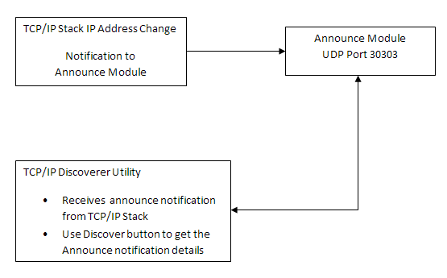

# Announce Module

TCP/IP Stack Library Announce Module for Microchip Devices

This library provides the API of the Announce Module that is available on the Microchip family of devices with a convenient C language interface. It is a module that belongs to the TCP/IP Stack. The module implements a proprietary network discovery protocol.

This module will facilitate device discovery on DHCP enabled networks by broadcasting a UDP message on port 30303 whenever the local IP address changes

**Abstraction Model**

**Discovering the Board**

The Announce module provides an easy way to determine useful parameters for your TCP/IP node’s interfaces. This module works in conjunction with the TCP/IP Discoverer personal computer utility to display an interface’s MAC and IPv4/IPv6 addresses, IPv6 multicast listeners, NBNS host name, and MAC type. During stack operation several events may cause an Announce packet to be broadcast on a particular interface. These include:

-   Reception of an Announce packet request on that interface

-   A DHCP event on that interface \(i.e., the interface has configured a new IPv4 address using DHCP\)

-   The addition or removal of an IPv6 Unicast Address from an interface \(after Duplicate Address Detection\)

-   The addition or removal of an IPv6 Multicast Listener from an interface

-   A user call to the ANNOUNCE\_Notify function specifying the interface on which to send the announce message

Each Announce packet is a UDP packet broadcast from the corresponding interface’s IP address. The payload is a series of fields beginning with an 8-bit field ID, followed by field information, followed by a field terminator \(0x0D 0x0A\). The current field IDs and information formats are:

-   0x01 – This field ID indicates that not all of the interface’s address information could be transmitted in one packet. There is no field information for this ID.

    -   0x01 0x0A 0x0D

-   0x02 – MAC address \(6 bytes\).

    -   0x02 0x00 0x04 0xA3 0x12 0x0f 0x94 0x0D 0x0A

-   0x03 – MAC type. The field information for this ID is a variable length string describing the MAC type of this interface – "ENCJ60", "ENCJ600", "97J60", "PIC32INT", "PIC32CINT", etc.

    -   0x03 ‘P’ ‘I’ ‘C’ ‘3’ ‘2’ ‘I’ ‘N’ ‘T’ 0x0D 0x0A

-   0x04 – Host name. The NBNS host name of the interface, with trailing spaces.

    -   0x04 ‘M’ ‘C’ ‘H’ ‘P’ ‘B’ ‘O’ ‘A’ ‘R’ ‘D’ ‘ ‘ ‘ ‘ ‘ ‘ ‘ ‘ ‘ ‘ ‘ ‘ ‘ ‘ 0x0D 0x0A

-   0x05 – The interface’s IPv4 address \(4 bytes, big-endian\).

    -   0x05 0x0A 0x00 0x01 0x03 0x0D 0x0A

-   0x06 – One of the interface's IPv6 unicast addresses \(16 bytes, big-endian\). Note that the interface may have more than one of these. The interface also has a corresponding solicited-node multicast address listener for every unicast address that is given. The interface may have static IP address.

    -   0x06 0xFE 0x80 0x00 0x00 0x00 0x00 0x00 0x00 0x02 0x04 0xA3 0xFF 0xFE 0x12 0x0F 0x94 0x0D 0x0A

    -   0x06 0xFD 0xFE 0xDC 0xDA 0x98 0x76 0x00 0x01 0x02 0x04 0xA3 0xFF 0xAA 0xAA 0xAA 0xAA 0x0D 0x0A

-   0x07 – One of the interface’s IPv6 multicast address listeners \(16 bytes, big-endian\). The solicited-node multicast address listeners will not be included.

    -   0x07 0xFF 0x02 0x00 0x00 0x00 0x00 0x00 0x00 0x00 0x00 0x00 0x00 0x00 0x00 0x00 0x01 0x0D 0x0A

-   0x08 – One of the interface's IPv6 default router address \(16 bytes, big-endian\).

    -   0x08 0xFD 0xFE 0xDC 0xDA 0x98 0x76 0x00 0x01 0x00 0x00 0x00 0x00 0x00 0x00 0x00 0x01 0x0D 0x0A

-   0x09 – One of the interface's IPv6 default gateway address \(16 bytes, big-endian\).

    -   0x08 0xFD 0xFE 0xDC 0xDA 0x98 0x76 0x00 0x01 0x00 0x00 0x00 0x00 0x00 0x00 0x00 0x01 0x0D 0x0A

**Library Interface**

This section describes the Application Programming Interface \(API\) functions of the Announce module. Refer to each section for a detailed description.

|Name|Description|
|----|-----------|
|**Functions**| |
|TCPIP\_ANNOUNCE\_MessageRequest| |
|TCPIP\_ANNOUNCE\_CallbackRegister|Allows the registration of a user callback.|
|TCPIP\_ANNOUNCE\_Task|Standard TCP/IP stack module task function.|
|**Data Types and Constants**| |
|TCPIP\_ANNOUNCE\_BROADCAST\_TYPE|Announce message type|
|TCPIP\_ANNOUNCE\_FIELD\_PAYLOAD|Announce payload types|
|TCPIP\_ANNOUNCE\_MESSAGE\_CALLBACK|Announce message callback function.|
|TCPIP\_ANNOUNCE\_MODULE\_CONFIG|Announce Configuration structure placeholder|

-   **[TCPIP\_ANNOUNCE\_BROADCAST\_TYPE Enumeration](GUID-45F06B75-B37F-41E2-81C1-B463535CC07D.md)**  

-   **[TCPIP\_ANNOUNCE\_CallbackRegister Function](GUID-DD1359E2-FCD4-4F82-8E75-EB78A2E1E7EF.md)**  

-   **[TCPIP\_ANNOUNCE\_FIELD\_PAYLOAD Enumeration](GUID-455343FF-D0C5-45F1-B7C2-C566D20C8D95.md)**  

-   **[TCPIP\_ANNOUNCE\_MESSAGE\_CALLBACK Type](GUID-AE6B35B3-8C2A-4FB7-BC76-38B4F9F3CBD5.md)**  

-   **[TCPIP\_ANNOUNCE\_MessageRequest Function](GUID-7499888A-AA54-4A66-8081-A446FCC0DB37.md)**  

-   **[TCPIP\_ANNOUNCE\_MODULE\_CONFIG Structure](GUID-5D55A772-A20A-478C-B885-4FE4984D0725.md)**  

-   **[TCPIP\_ANNOUNCE\_Task Function](GUID-9A0666DA-6B06-4C37-B365-9537F3BCFD78.md)**  

**Parent topic:**[MPLAB® Harmony TCP/IP Library](GUID-01A0A1D8-EC9B-4EFF-B8E4-D154B555FEF2.md)

