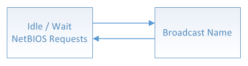

# NBNS Module

The NetBIOS Name Service protocol associates host names with IP addresses, similarly to DNS, but on the same IP subnet. Practically, this allows the assignment of human-name host names to access boards on the same subnet. For example. in the TCP/IP Demonstration applications projects, the development boards are programmed with the human name like 'mchpboard\_c' so it can be accessed directly instead of with its IP address.

**Abstraction Model**

**Library Interface**

|Name|Description|
|----|-----------|
|**Macros**||
|TCPIP\_NBNS\_TASK\_TICK\_RATE|NBNS task processing rate The default value is 110 milliseconds. The lower the rate \(higher the frequency\) the higher the module priority and higher module performance can be obtained The value cannot be lower than the TCPIP\_STACK\_TICK\_RATE.|
|**Functions**||
|TCPIP\_NBNS\_Task|Standard TCP/IP stack module task function.|
|**Data Types and Constants**||
|TCPIP\_NBNS\_MODULE\_CONFIG|Placeholder for NBNS configuration upgrades.|

-   **[TCPIP\_NBNS\_MODULE\_CONFIG Structure](GUID-748C5E7F-0CD8-443E-BBD5-55D907D25644.md)**  

-   **[TCPIP\_NBNS\_Task Function](GUID-188B85D5-4D34-431D-952F-DEB7B8E5C7FA.md)**  

**Parent topic:**[MPLAB® Harmony TCP/IP Library](GUID-01A0A1D8-EC9B-4EFF-B8E4-D154B555FEF2.md)

