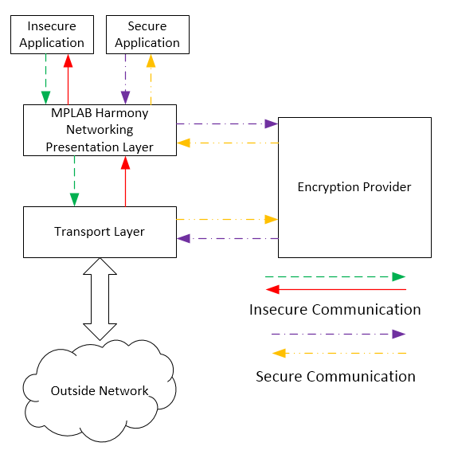

# Networking Presentation Layer

The MPLAB Harmony Networking Presentation Layer is an abstracted middleware layer that provides an encrypted channel. There are three interfaces for the layer:

Client - this interface starts a network session and reads and writes clear text data Provider - this interface encrypts the clear text into cipher text, and decrypts cipher text into clear text Transport - this interface transmits and receives the cipher text The linkage to the provider interface is done through function pointers to isolate it from the rest of MPLAB Harmony. This allows for any provider to be used. Please note that Microchip does not supply a commercially licensed TLS provider. wolfSSL \(formerly CyaSSL\) is supported as a provider for evaluation purposes only.

The transport interface is abstracted to function pointers as well, to allow for any transport to be used. Currently, only the MPLAB Harmony TCP/IP Stack is used as a transport; however, other transports can be created, such as UART transport, which can be used instead.

The MPLAB Harmony Networking Presentation Layer has a Tasks function that is used to continuously call the provider's connect and accept functions until they run to success of failure, thereby hiding this job from the application.

**Abstraction Model**

**Library Overview**

The Library Interface routines are divided into various sub-sections, which address one of the blocks or the overall operation of the Networking Presentation Layer.

|Library Interface Section|Description|
|-------------------------|-----------|
|System Functions|Provides "initialize" functions and a "tasks" function for performing general presentation layer tasks.|
|Socket Functions|Provides various socket-related functions for the purpose of connecting, flushing, and setting options, among others.|
|Certificate Store Functions|Provides certificate-related functions for the purpose of obtaining certificates and keys.|

**Configuring the Library**

The configuration of the Networking Presentation Layer is done as part of the MPLAB Harmony TCP/IP Stack configuration and specific NET\_PRES parameters are generated in the configuration.h.

This header file contains the configuration selection for the Networking Presentation Layer. Based on the selections made, the Networking Presentation Layer may support the selected features. These configuration settings will apply to all instances of the Networking Presentation Layer.

This header can be placed anywhere; however, the path of this header needs to be present in the include search path for a successful build. Refer to the TCP/IP Demonstrations Help section for more details.

**Library Interface**

This section describes the Application Programming Interface \(API\) functions of the Networking Presentation Layer.

|Name|Description|
|----|-----------|
|**System Functions**||
|NET\_PRES\_Deinitialize|Deinitializes the Network Presentation Layer Instance.|
|NET\_PRES\_Initialize|Initializes the Network Presentation Layer sub-system with the configuration data.|
|NET\_PRES\_Reinitialize|Reinitializes the instance of the presentation layer.|
|NET\_PRES\_Tasks|MPLAB Harmony tasks function used for general presentation layer tasks.|
|NET\_PRES\_Status|Provides the current status of the MPLAB Harmony Networking Presentation Layer.|
|**Socket Functions**||
|NET\_PRES\_SocketBind|Binds a socket to a local address.|
|NET\_PRES\_SocketClose|Disconnects an open socket and destroys the socket handle, releasing the associated resources.|
|NET\_PRES\_SocketConnect|Connects a client socket.|
|NET\_PRES\_SocketDiscard|Discards any pending data in the RX FIFO.|
|NET\_PRES\_SocketDisconnect|Disconnects an open socket.|
|NET\_PRES\_SocketEncryptSocket|This function turns an insecure socket into a secure socket. Details: This function will turn an unencrypted socket into an encrypted socket and starts encryption negotiation.|
|NET\_PRES\_SocketFlush|Immediately transmits all pending TX data.|
|NET\_PRES\_SocketGetTransportHandle|This function returns the transport layer handle. Details: This function returns the transport layer handle for a valid socket|
|NET\_PRES\_SocketInfoGet|Obtains information about a currently open socket.|
|NET\_PRES\_SocketIsConnected|Determines whether a socket has an established connection.|
|NET\_PRES\_SocketIsNegotiatingEncryption|This function checks if encryption negotiation is still in progress.|
|NET\_PRES\_SocketIsOpenModeSupported|Checks to see if a mode is supported by open.|
|NET\_PRES\_SocketIsSecure|This function checks whether a connection is secure.|
|NET\_PRES\_SocketLastError|This function returns the last error code for this socket. Details: This function will return the last error code that was set for this socket and it will clear the current error code. An error code is set whenever a socket operation fails for some missing functionality, bad parameter, etc.|
|NET\_PRES\_SocketOpen|Opens a presentation socket.|
|NET\_PRES\_SocketOptionsGet|Allows the options for a socket such as, current RX/TX buffer size, etc., to be obtained.|
|NET\_PRES\_SocketOptionsSet|Allows setting options to a socket like adjust RX/TX buffer size, etc.|
|NET\_PRES\_SocketPeek|Reads a specified number of data bytes from the RX buffer/FIFO without removing them from the buffer.|
|NET\_PRES\_SocketRead|Reads an array of data bytes from a socket's RX buffer/FIFO.|
|NET\_PRES\_SocketReadIsReady|Determines how many bytes can be read from the RX buffer.|
|NET\_PRES\_SocketRemoteBind|Binds a socket to a remote local address.|
|NET\_PRES\_SocketSignalHandlerDeregister|Deregisters a previously registered socket signal handler.|
|NET\_PRES\_SocketSignalHandlerRegister|Registers a socket signal handler.|
|NET\_PRES\_SocketWasReset|Self-clearing semaphore indicating socket reset.|
|NET\_PRES\_SocketWrite|Takes a buffer and sends it to the encryption provider.|
|NET\_PRES\_SocketWriteIsReady|Determines how much free space is available in the TX buffer.|
|**Certificate Store Functions**||
|NET\_PRES\_CertStoreGetCACerts|This function gets the CA certificates from the store,|
|NET\_PRES\_CertStoreGetServerCert|This function gets a server certificate and key from the certificate store.|
|**Data Types and Constants**||
|\_NET\_PRES\_EncProviderObject|Defines the data that the presentation layer needs from the provider.|
|\_NET\_PRES\_TransportObject|Defines the data that the transport layer needs to provide to the Networking Presentation Layer.|
|NET\_PRES\_INDEX|Sets the type for the presentation layer index.|
|NET\_PRES\_INIT\_DATA|Initializes a Presentation layer.|
|NET\_PRES\_INST\_DATA|Initializes a Presentation layer.|
|NET\_PRES\_SIGNAL\_FUNCTION|MPLAB Harmony Networking Presentation Layer Signal function.|
|NET\_PRES\_SIGNAL\_HANDLE|Sets the type for the presentation layer signal handle.|
|NET\_PRES\_SKT\_HANDLE\_T|Sets the type for the presentation layer socket handle.|
|NET\_PRES\_ADDRESS|NET\_PRES address|
|NET\_PRES\_EncProviderConnect|Connects the function to the provider.|
|NET\_PRES\_EncProviderConnectionClose|Defines the close function to the provider.|
|NET\_PRES\_EncProviderDeinit|Defines the deinitialization function for the provider.|
|NET\_PRES\_EncProviderInit|Defines the initialization function to the encryption provider.|
|NET\_PRES\_EncProviderIsInitialized|Determines whether the encryption provider has been initialized.|
|NET\_PRES\_EncProviderObject|Defines the data that the presentation layer needs from the provider.|
|NET\_PRES\_EncProviderOpen|Defines the open connection function to the provider.|
|NET\_PRES\_EncProviderRead|Defines the read function to the provider|
|NET\_PRES\_EncProviderWrite|Defines the write function to the provider.|
|NET\_PRES\_EncSessionStatus|Defines the enumeration for the state and status of the encrypted portion of a connection.|
|NET\_PRES\_SKT\_ADDR\_T|NET\_PRES address type|
|NET\_PRES\_SKT\_ERROR\_T|NET\_PRES error type|
|NET\_PRES\_SKT\_OPTION\_TYPE|NET\_PRES option type|
|NET\_PRES\_SKT\_PORT\_T|Sets the type for the presentation layer port.|
|NET\_PRES\_SKT\_T|NET\_PRES socket type|
|NET\_PRES\_TRANS\_ADDR\_T|Defines a generic address structure to pass to the transport layer.|
|NET\_PRES\_TRANS\_ADDRESS\_TYPE|Defines the enumeration for the type of address.|
|NET\_PRES\_TRANS\_OPTION\_T|Defines the enumeration for the type of options.|
|NET\_PRES\_TransBind|Binds a socket to a local address.|
|NET\_PRES\_TransBool|Generic function prototype for functions that return a bool.|
|NET\_PRES\_TransClose|Function prototype for functions that closes a socket.|
|NET\_PRES\_TransDiscard|Function prototype for functions that clears a socket's RX buffer.|
|NET\_PRES\_TransHandlerRegister|Function prototype that registers a handler with a socket.|
|NET\_PRES\_TransOpen|Opens a presentation socket.|
|NET\_PRES\_TransOption|Sets of gets a socket's options.|
|NET\_PRES\_TransPeek|Function prototype for functions that peeks on the socket's buffer.|
|NET\_PRES\_TransportObject|Defines the data that the transport layer needs to provide to the Networking Presentation Layer.|
|NET\_PRES\_TransRead|Defines the read function provided by the transport layer.|
|NET\_PRES\_TransReady|Defines the ready function provided by the transport layer.|
|NET\_PRES\_TransSignalHandlerDeregister|Function prototype that deregisters a handler with a socket.|
|NET\_PRES\_TransSocketInfoGet|Function prototype for functions that gets the information on a socket.|
|NET\_PRES\_TransWrite|Defines the write function provided by the transport layer.|
|NET\_PRES\_INVALID\_SOCKET|Invalid socket indicator macro.|
|*NET\_PRES\_CERTSTORE\_H*|This is macro *NET\_PRES\_CERTSTORE\_H*.|
|*NET\_PRES\_ENCRYPTION\_PROVIDER\_API\_H*|This is macro *NET\_PRES\_ENCRYPTION\_PROVIDER\_API\_H*.|
|*NET\_PRES\_SOCKET\_API*|This is macro *NET\_PRES\_SOCKET\_API*.|
|*NET\_PRES\_TRANSPORT\_API\_H*|This is macro *NET\_PRES\_TRANSPORT\_API\_H*.|
|*NET\_PRES\_H*|This is macro *NET\_PRES\_H*.|
|NET\_PRES\_EncProviderReadReady|Defines the read ready function to the provider|
|NET\_PRES\_EncProviderWriteReady|Defines the write ready function to the provider.|
|NET\_PRES\_TransIsPortDefaultSecured|Checks to see if a port is encrypted by default.|
|NET\_PRES\_EncProviderMaxOutputSize|Defines the maximum output size function to the provider.|
|NET\_PRES\_EncProviderOutputSize|Defines the output size function to the provider.|

-   **[NET\_PRES\_ADDRESS Structure](GUID-9F99FA2F-E094-41F2-8A2A-AC62313B0A62.md)**  

-   **[NET\_PRES\_CertStoreGetCACerts Function](GUID-8D40C273-579B-431C-8350-F9A2B709D259.md)**  

-   **[NET\_PRES\_CertStoreGetServerCert Function](GUID-16E9830E-54F2-4688-B1E4-9B92F761DC5E.md)**  

-   **[NET\_PRES\_Deinitialize Function](GUID-AFECA098-E4EC-4847-AC64-921868BB48BA.md)**  

-   **[NET\_PRES\_EncProviderConnect Type](GUID-606205B5-997A-4AA8-BB6E-08429D855CA7.md)**  

-   **[NET\_PRES\_EncProviderConnectionClose Type](GUID-36D5D72A-D963-4A8C-8012-D552407D8AB0.md)**  

-   **[NET\_PRES\_EncProviderDeinit Type](GUID-E64B3C2D-C626-4B06-B081-9BECE00C6AD2.md)**  

-   **[NET\_PRES\_EncProviderInit Type](GUID-1334BC43-35EF-48EF-877B-770E61118974.md)**  

-   **[NET\_PRES\_EncProviderIsInitialized Type](GUID-4EEA334F-2FEB-44C1-A9DF-D5ADFE6717A8.md)**  

-   **[NET\_PRES\_EncProviderMaxOutputSize Type](GUID-20567716-31DC-461C-B196-A643797C90DB.md)**  

-   **[NET\_PRES\_EncProviderObject Structure](GUID-85F57BC3-AB6F-4F15-AFE1-99791B84C799.md)**  

-   **[NET\_PRES\_EncProviderOpen Type](GUID-452D786F-6D8D-4201-BB10-6483F678465E.md)**  

-   **[NET\_PRES\_EncProviderOutputSize Type](GUID-C0360366-50E8-4421-B1F3-A8D7A3FC81E2.md)**  

-   **[NET\_PRES\_EncProviderRead Type](GUID-2C33D70C-FEB0-4467-BBDD-91FABD33F0F8.md)**  

-   **[NET\_PRES\_EncProviderReadReady Type](GUID-59104AE1-2716-4892-A5C5-8D1C643E81C1.md)**  

-   **[NET\_PRES\_EncProviderWrite Type](GUID-1EE89A71-63B4-4674-B669-A8726597917D.md)**  

-   **[NET\_PRES\_EncProviderWriteReady Type](GUID-68556710-752A-4812-8AD1-86673574C3E2.md)**  

-   **[NET\_PRES\_EncSessionStatus Enumeration](GUID-4FDEB3AD-E2FB-4041-B5EC-3DB621AF809B.md)**  

-   **[NET\_PRES\_INDEX Type](GUID-D8D0D1D6-ECAA-40CF-B09C-90F06AE6107F.md)**  

-   **[NET\_PRES\_INIT\_DATA Structure](GUID-5FE0E246-65E8-4D1D-AD2B-A0998C58F0D7.md)**  

-   **[NET\_PRES\_Initialize Function](GUID-524962B7-0E09-4846-8F53-7213CA71FF2D.md)**  

-   **[NET\_PRES\_INST\_DATA Structure](GUID-AA37C1CF-735E-41C1-99D3-ADDED9199035.md)**  

-   **[NET\_PRES\_INVALID\_SOCKET Macro](GUID-F54F388D-F63E-44C5-8F04-CC6ADEE3E514.md)**  

-   **[NET\_PRES\_Reinitialize Function](GUID-E8BBC278-0227-40A6-AD91-354FC3A588EC.md)**  

-   **[NET\_PRES\_SIGNAL\_FUNCTION Type](GUID-B1B95E81-E580-41FE-97B9-4C5A476C550D.md)**  

-   **[NET\_PRES\_SIGNAL\_HANDLE Type](GUID-EC147DB3-37CB-4CFA-9AE2-2396C7F3E8C9.md)**  

-   **[NET\_PRES\_SKT\_ADDR\_T Enumeration](GUID-02895CBF-4E55-4E31-817E-11206B95FDE1.md)**  

-   **[NET\_PRES\_SKT\_ERROR\_T Enumeration](GUID-D8879307-6878-418A-9A76-492EB5093D5D.md)**  

-   **[NET\_PRES\_SKT\_HANDLE\_T Type](GUID-5D83E6FA-5BCD-43DC-9CC3-5583A0FF7197.md)**  

-   **[NET\_PRES\_SKT\_OPTION\_TYPE Enumeration](GUID-B809DB24-044F-4E28-A7B5-594461FB06EE.md)**  

-   **[NET\_PRES\_SKT\_PORT\_T Type](GUID-AE3AD187-8B6D-4C12-95E4-57C2C14D5CF1.md)**  

-   **[NET\_PRES\_SKT\_T Enumeration](GUID-298A4190-0B65-4FC5-BEFA-8536001B4168.md)**  

-   **[NET\_PRES\_SocketBind Function](GUID-8C8739A7-EB00-469C-AFED-6DB457E65D96.md)**  

-   **[NET\_PRES\_SocketClose Function](GUID-06EF50DE-6188-426E-90FE-9CA7BC8D7114.md)**  

-   **[NET\_PRES\_SocketConnect Function](GUID-96055254-A7FF-4F59-982B-4086005F2E29.md)**  

-   **[NET\_PRES\_SocketDiscard Function](GUID-AFDF4187-9B0B-4C3C-9324-7C1F3B0301B7.md)**  

-   **[NET\_PRES\_SocketDisconnect Function](GUID-10FF60D8-3CB1-45C2-A2ED-D638B2839331.md)**  

-   **[NET\_PRES\_SocketEncryptSocket Function](GUID-ED554FEC-7E5C-4C06-AC60-077D458A16B1.md)**  

-   **[NET\_PRES\_SocketFlush Function](GUID-6421739B-0ECE-4F81-93DF-4F9790E03278.md)**  

-   **[NET\_PRES\_SocketGetTransportHandle Function](GUID-26F6675F-2B57-4AAE-9982-52DE60FA97FD.md)**  

-   **[NET\_PRES\_SocketInfoGet Function](GUID-ECBD9274-F169-4E39-A7B9-378AF111097E.md)**  

-   **[NET\_PRES\_SocketIsConnected Function](GUID-ACECEC62-5566-449B-A63D-70C15556BF2B.md)**  

-   **[NET\_PRES\_SocketIsNegotiatingEncryption Function](GUID-78B04367-8967-496E-BF27-437D88F7CBFE.md)**  

-   **[NET\_PRES\_SocketIsOpenModeSupported Function](GUID-9A9F54F8-09FE-483F-BA62-886871114B72.md)**  

-   **[NET\_PRES\_SocketIsSecure Function](GUID-867EDFFC-8900-463A-8E2C-F342C9DFFC67.md)**  

-   **[NET\_PRES\_SocketLastError Function](GUID-C9EC53A2-372C-4EE3-8093-316236CFDA93.md)**  

-   **[NET\_PRES\_SocketOpen Function](GUID-1E9FBEFE-AB48-4348-A53B-035ACA2FCA79.md)**  

-   **[NET\_PRES\_SocketOptionsGet Function](GUID-5B2BC038-DFCD-4BA2-9DA9-CC9178C93B8B.md)**  

-   **[NET\_PRES\_SocketOptionsSet Function](GUID-4D01713E-3500-4C3B-B5BB-3D12C3FC3157.md)**  

-   **[NET\_PRES\_SocketPeek Function](GUID-7428463B-358F-43F8-8965-2DFEB7CD1C31.md)**  

-   **[NET\_PRES\_SocketRead Function](GUID-1491B842-4921-4322-AB69-E29C7B1790C5.md)**  

-   **[NET\_PRES\_SocketReadIsReady Function](GUID-86C5EC0B-8A2C-453C-8D10-AE1E66E1DF51.md)**  

-   **[NET\_PRES\_SocketRemoteBind Function](GUID-E88A18CC-16AB-4D37-9942-356483BC10D0.md)**  

-   **[NET\_PRES\_SocketSignalHandlerDeregister Function](GUID-7A0113E3-4E70-4523-AEED-41E98ED0DD57.md)**  

-   **[NET\_PRES\_SocketSignalHandlerRegister Function](GUID-DEBA081A-E861-4901-8C83-D90C5C05A50D.md)**  

-   **[NET\_PRES\_SocketWasReset Function](GUID-EC1B96C9-CB91-4719-A5FC-CEA7FD9CCFC8.md)**  

-   **[NET\_PRES\_SocketWrite Function](GUID-9AC4FEC0-84BA-4E2C-93EF-35B3F6C91518.md)**  

-   **[NET\_PRES\_SocketWriteIsReady Function](GUID-0727B400-CC9C-4F2B-87C8-1FC91E4C62F8.md)**  

-   **[NET\_PRES\_Status Function](GUID-51BE11D4-8D24-43BA-9300-1B1382FE077D.md)**  

-   **[NET\_PRES\_Tasks Function](GUID-E374AB9C-2664-4786-B6FC-5B5C88311005.md)**  

-   **[NET\_PRES\_TRANS\_ADDR\_T Structure](GUID-655618AA-5876-4320-9ED2-DFECE543BB57.md)**  

-   **[NET\_PRES\_TRANS\_ADDRESS\_TYPE Enumeration](GUID-43CB853B-06D8-4F48-80BD-46E29145B2F0.md)**  

-   **[NET\_PRES\_TRANS\_OPTION\_T Enumeration](GUID-F77D6148-BF49-4712-B38A-0A482554D783.md)**  

-   **[NET\_PRES\_TransBind Type](GUID-3D7BA57F-823F-46C0-9F35-1FDCFD750061.md)**  

-   **[NET\_PRES\_TransBool Type](GUID-3EF78452-3F4A-4D80-8100-8AF7E15C89BE.md)**  

-   **[NET\_PRES\_TransClose Type](GUID-966381B9-C7A1-4570-9ADD-C5455814FC42.md)**  

-   **[NET\_PRES\_TransDiscard Type](GUID-B786C127-6FE1-408B-A56B-C61770D1B058.md)**  

-   **[NET\_PRES\_TransHandlerRegister Type](GUID-2D2E1AE8-AEC5-4CD4-9F65-E871C14090AE.md)**  

-   **[NET\_PRES\_TransIsPortDefaultSecured Type](GUID-44EE1044-2000-4DDE-843F-49D8120E3A07.md)**  

-   **[NET\_PRES\_TransOpen Type](GUID-81ADA0CF-346C-463C-9D5A-D721C3A7E2AA.md)**  

-   **[NET\_PRES\_TransOption Type](GUID-72A42486-DE9F-4B4F-AA49-1940C08D83C6.md)**  

-   **[NET\_PRES\_TransPeek Type](GUID-AD92D49B-6FE0-4B29-9BE9-A77D7F7B3357.md)**  

-   **[NET\_PRES\_TransportObject Structure](GUID-C43FFD81-6662-48D3-9E17-6FD5778DA7BB.md)**  

-   **[NET\_PRES\_TransRead Type](GUID-08FBA7C3-98EE-43B2-B6CE-54B88FFFD70B.md)**  

-   **[NET\_PRES\_TransReady Type](GUID-12A479F7-B8AD-42B6-8E62-D188E3688AB2.md)**  

-   **[NET\_PRES\_TransSignalHandlerDeregister Type](GUID-78AA9C7F-FB18-42D9-9091-9623B7566BB0.md)**  

-   **[NET\_PRES\_TransSocketInfoGet Type](GUID-617D683D-30A5-461F-A7B4-109568A59E47.md)**  

-   **[NET\_PRES\_TransWrite Type](GUID-51877883-0A3E-4AF6-963B-F733F4FE68CD.md)**  

**Parent topic:**[MPLAB® Harmony TCP/IP Library](GUID-01A0A1D8-EC9B-4EFF-B8E4-D154B555FEF2.md)

