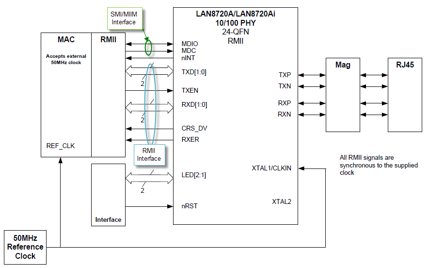

# Ethernet GMAC Driver Library

The Ethernet Media Access Controller \(GMAC\) module implements a 10/100 Mbps Ethernet MAC, compatible with the IEEE 802.3 standard. The GMAC can operate in either half or full duplex mode at all supported speeds.

Embedded Characteristics

-   Compatible with IEEE Standard 802.3

-   10, 100 Mbps operation

-   Full and half duplex operation at all supported speeds of operation

-   Statistics Counter Registers for RMON/MIB

-   MII interface to the physical layer

-   Integrated physical coding

-   Direct memory access \(DMA\) interface to external memory

-   Support for 6 priority queues in DMA

-   8 KB transmit RAM and 4 KB receive RAM

-   Programmable burst length and endianism for DMA

-   Interrupt generation to signal receive and transmit completion, errors or other events

-   Automatic pad and cyclic redundancy check \(CRC\) generation on transmitted frames

-   Automatic discard of frames received with errors

-   Receive and transmit IP, TCP and UDP checksum offload. Both IPv4 and IPv6 packet types supported

-   Address checking logic for four specific 48-bit addresses, four type IDs, promiscuous mode, hash matching of unicast and multicast destination addresses and Wake-on-LAN

-   Management Data Input/Output \(MDIO\) interface for physical layer management

-   Support for jumbo frames up to 10240 Bytes

-   Full duplex flow control with recognition of incoming pause frames and hardware generation of transmitted pause frames

-   Half duplex flow control by forcing collisions on incoming frames

-   Support for 802.1Q VLAN tagging with recognition of incoming VLAN and priority tagged frames

-   Support for 802.1Qbb priority-based flow control

-   Programmable Inter Packet Gap \(IPG\) Stretch

-   Recognition of IEEE 1588 PTP frames

-   IEEE 1588 time stamp unit \(TSU\)

-   Support for 802.1AS timing and synchronization

-   Supports 802.1Qav traffic shaping on two highest priority queues

**Abstraction Model**

The Ethernet Controller provides the modules needed to implement a 10/100 Mbps Ethernet node using an external Ethernet PHY chip. The PHY chip provides a digital-analog interface as part of the Physical Layer and the controller provides the Media Access Controller \(MAC\)\_layer above the PHY.

As shown in figure below, the Ethernet Controller consists of the following modules:

-   Media Access Control \(MAC\) block: Responsible for implementing the MAC functions of the Ethernet IEEE 802.3 Specification

-   Flow Control \(FC\) block: Responsible for control of the transmission of PAUSE frames. \(Reception of PAUSE frames is handled within the MAC.\)

-   RX Filter \(RXF\) block: This module performs filtering on every receive packet to determine whether each packet should be accepted or rejected

-   TX DMA/TX Buffer Management Engine: The TX DMA and TX Buffer Management engines perform data transfers from the memory \(using descriptor tables\) to the MAC Transmit Interface

-   RX DMA/RX Buffer Management Engine: The RX DMA and RX Buffer Management engines transfer receive packets from the MAC to the memory \(using descriptor tables\)

For completeness, we also need to look at the interface diagram of a representative Ethernet PHY. As shown in Figure 2, the PHY has two interfaces, one for configuring and managing the PHY \(SMI/MIIM\) and another for transmit and receive data \(RMII or MII\). The SMI/MIIM interface is the responsibility of the Ethernet PHY Driver Library. When setting up the Ethernet PHY, this Ethernet driver calls primitives from the Ethernet PHY Driver library. The RMII/MII data interface is the responsibility of the Ethernet MAC Driver Library \(this library\).

**Library Interface**

|Name|Description|
|----|-----------|
|**Client Level Functions**||
|DRV\_GMAC\_Close|Closes a client instance of the PIC32 MAC Driver.|
|DRV\_GMAC\_Open|Opens a client instance of the PIC32 MAC Driver.|
|DRV\_GMAC\_Deinitialize|Deinitializes the PIC32 Ethernet MAC.|
|DRV\_GMAC\_Initialize|Initializes the PIC32 Ethernet MAC.|
|DRV\_GMAC\_Reinitialize|Reinitializes the PIC32 Ethernet MAC.|
|**Receive Functions**||
|DRV\_GMAC\_PacketRx|This is the MAC receive function.|
|DRV\_GMAC\_RxFilterHashTableEntrySet|Sets the current MAC hash table receive filter.|
|**Transmit Functions**||
|DRV\_GMAC\_PacketTx|MAC driver transmit function.|
|**Event Functions**||
|DRV\_GMAC\_EventAcknowledge|Acknowledges and re-enables processed events.|
|DRV\_GMAC\_EventMaskSet|Enables/disables the MAC events.|
|DRV\_GMAC\_EventPendingGet|Returns the currently pending events.|
|**Other Functions**||
|DRV\_GMAC\_ConfigGet|Gets the current MAC driver configuration.|
|DRV\_GMAC\_LinkCheck|Checks current link status.|
|DRV\_GMAC\_ParametersGet|MAC parameter get function.|
|DRV\_GMAC\_PowerMode|Selects the current power mode for the Ethernet MAC.|
|DRV\_GMAC\_Process|MAC periodic processing function.|
|DRV\_GMAC\_RegisterStatisticsGet|Gets the current MAC hardware statistics registers.|
|DRV\_GMAC\_Status|Provides the current status of the MAC driver module.|
|DRV\_GMAC\_StatisticsGet|Gets the current MAC statistics.|
|DRV\_GMAC\_Tasks|Maintains the EThernet MAC driver's state machine.|
|**Data Types and Constants**||
|DRV\_GMAC\_INDEX\_COUNT|Number of valid Ethernet driver indices.|
|\_DRV\_GMAC\_H|This is macro \_DRV\_GMAC\_H.|
|||

-   **[DRV\_GMAC\_Close Function](GUID-A4833A60-F6A0-4EC8-8F8E-A0ABF7C0B545.md)**  

-   **[DRV\_GMAC\_ConfigGet Function](GUID-4F98C91D-7BB3-4806-B6BB-AE327FE987A1.md)**  

-   **[DRV\_GMAC\_Deinitialize Function](GUID-2EB734CC-B9C6-455E-9884-2DBAB08E1EA8.md)**  

-   **[DRV\_GMAC\_EventAcknowledge Function](GUID-3FCD898D-4FBE-45F7-90AF-5AFA95E68831.md)**  

-   **[DRV\_GMAC\_EventMaskSet Function](GUID-622D99A6-36C4-45DC-98D4-95EFDA77AA18.md)**  

-   **[DRV\_GMAC\_EventPendingGet Function](GUID-2A0AD6C6-F354-47C7-BBF8-FD4B8D918EAD.md)**  

-   **[DRV\_GMAC\_INDEX\_COUNT Macro](GUID-A0386E9E-955F-4A64-8E05-C5A3DB49EE36.md)**  

-   **[DRV\_GMAC\_Initialize Function](GUID-EC961F58-4F67-4CB1-A47F-22AEE2FC3327.md)**  

-   **[DRV\_GMAC\_LinkCheck Function](GUID-805F2DE9-7E0B-4B05-89A4-AEB96FDC36E6.md)**  

-   **[DRV\_GMAC\_Open Function](GUID-439D69E3-ABD1-4304-BDCB-F8DBA503B7EB.md)**  

-   **[DRV\_GMAC\_PacketRx Function](GUID-4882F386-766E-438D-8CDD-0F9D48F29610.md)**  

-   **[DRV\_GMAC\_PacketTx Function](GUID-0CD0B980-1595-4B23-90C9-8CDD654F99C5.md)**  

-   **[DRV\_GMAC\_ParametersGet Function](GUID-8C5BDD05-DD86-40A9-B4D0-8DF92452F7C7.md)**  

-   **[DRV\_GMAC\_PowerMode Function](GUID-59E56A40-997A-4938-8323-43385CAAB59F.md)**  

-   **[DRV\_GMAC\_Process Function](GUID-AF9C23DA-AF83-441B-8598-6D10D255B441.md)**  

-   **[DRV\_GMAC\_RegisterStatisticsGet Function](GUID-9AA24DCC-E1F4-42A4-A028-45365EA4B1BF.md)**  

-   **[DRV\_GMAC\_Reinitialize Function](GUID-BB4AAF17-373C-48C5-88D6-C15D9E926EBE.md)**  

-   **[DRV\_GMAC\_RxFilterHashTableEntrySet Function](GUID-1A2A6D25-8F46-4DCB-806C-18384140A6BC.md)**  

-   **[DRV\_GMAC\_StatisticsGet Function](GUID-F246FB89-BF12-48D4-B25C-AE8239E4C104.md)**  

-   **[DRV\_GMAC\_Status Function](GUID-608FBC47-100D-4D70-AED4-BE906B761FC9.md)**  

-   **[DRV\_GMAC\_Tasks Function](GUID-30247EE9-2918-44C6-89A5-06347C527C83.md)**  

**Parent topic:**[MPLAB® Harmony TCP/IP Library](GUID-01A0A1D8-EC9B-4EFF-B8E4-D154B555FEF2.md)

