# Getting Started with TCP/IP Configurator

-   Open MPLAB X IDE

-   Open existing MCC project / Create MCC project

-   Start MCC

-   Select TCP/IP Configurator from plugin drop-down menu

    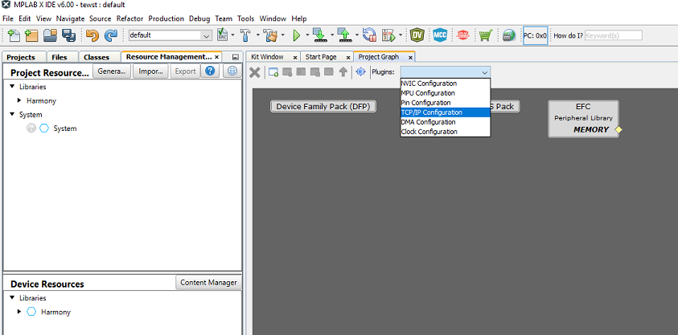

-   TCP/IP Configurator starting with Overview

    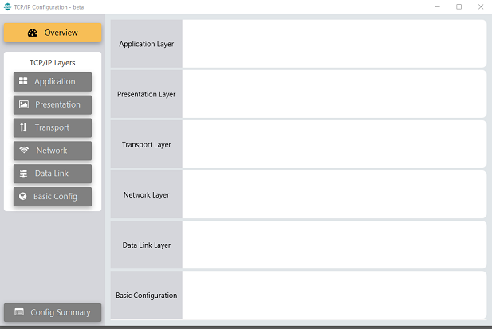

-   Click 'Application' to add Application Layer Components

    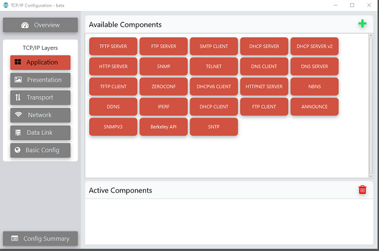

-   Select from 'Available Components'. Click '+' or drag and drop to add  selected components

    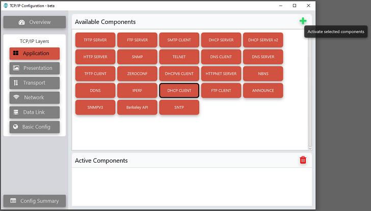

-   This window popup, if Harmony Core module is not yet added to the project.  Click 'Yes' to add HarmonyCore

    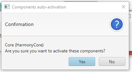

-   Add TCP/IP modules from different layers. For example, to add from Transport  Layer, select Transport

    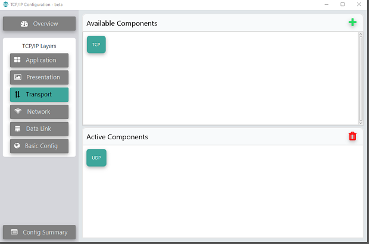

-   Add from Network Layer

    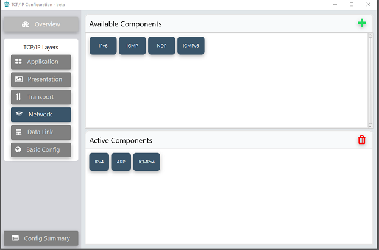

-   Select Data Link Layer

    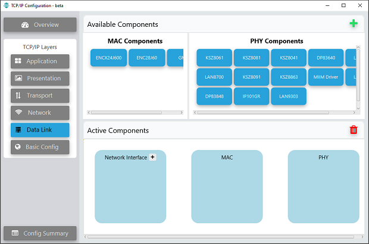

-   Click '+' on Network Interface to add an interface

    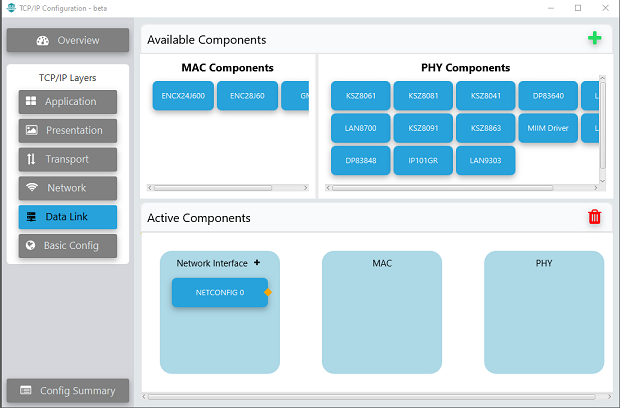

-   Add MAC and PHY Components

    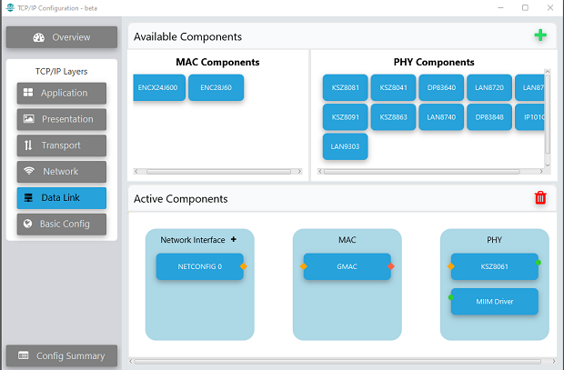

-   Connect MAC, PHY and Network Interface. \(MIIM Driver should be added with PHY  modules\)

    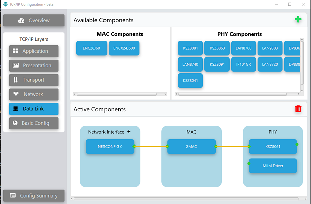

-   Select Basic Config layer to add components. TCP/IP Core will be added by  default

    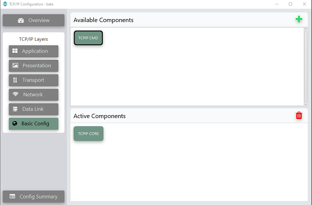

-   Select Configuration Summary to verify missing dependencies.

    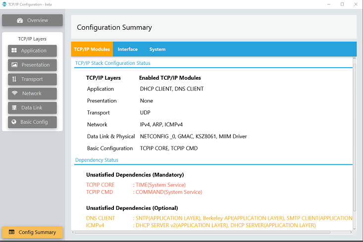

-   Select Overview to verify the complete TCP/IP configuration

    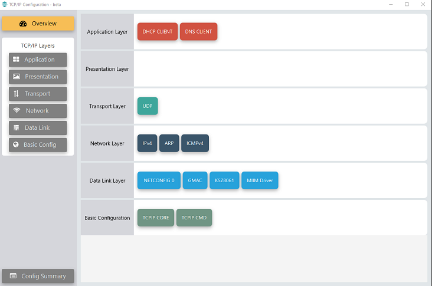

-   Select any added TCP/IP Components. Configure the module from 'Configuration  Options'

    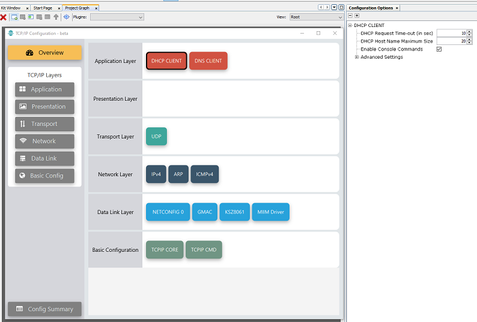

-   After completing TCP/IP Configuration, switch to MCC project graph

-   Add dependencies like SYS\_Console, SYS\_TIME, SYS\_COMMAND in Root Layer of  project graph

-   Save Configuration

The user needs to configure all the modules outside TCP/IP Stack using project graph.  Other configurations required for any TCP/IP application demo to work are,

-   Clock Configuration

-   Pin Configuration

-   System Heap Configuration

-   MPU Configuration for Non-Cacheable memory region. This is applicable only  for SAME70/V71 projects

After these configurations, 'Generate' the code from MCC. Build the code and program  it to target board. Now you are ready to test your TCP/IP application.

The demos created using MHC can be migrated to TCP/IP Configurator. Follow the steps  to [Migrate MHC based TCP/IP Demos to TCP/IP Configurator](GUID-3A0DFD6E-F6BC-4FE9-BAE4-BE22C34C21C0.md)

**Parent topic:**[TCPIP Configurator](GUID-F4E4B0BB-BCBC-45A1-8F5B-7E4D76C83CF3.md)

