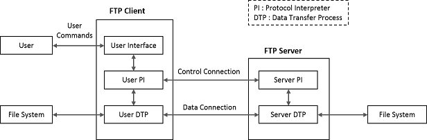

# FTP Client Module

The File Transfer Protocol \(FTP\) Client module will allow your application to upload the files to, and download the files from, any FTP server. This protocol enables transfer of data reliably and efficiently between different devices, without worrying about the different file storage systems among hosts.

**Abstraction Model**

**How The Library Works**

Files are transferred via the data connection. The control connection is used for the transfer of commands and the replies to these commands. Several commands are concerned with the transfer of data between hosts. These data transfer commands include the command which specify how the data is to be transmitted and the way in which the data is to be represented.

The mechanism of transferring data consists of setting up the data connection to the appropriate ports and choosing the parameters for the transfer.

The passive data transfer process shall "listen" on the data port prior to sending a transfer request command.

The FTP request command determines the direction of the data transfer. The server, upon receiving the transfer request, will initiate the data connection to the port. When the connection is established, the data

transfer begins between DTP’s, and the server-PI sends a confirming reply to the user-PI.

It is possible for the user to specify an alternate data port by use of the PORT command.

In general, it is the server’s responsibility to maintain the data connection, to initiate it and to close it.

**Library Interface**

|Name|Description|
|----|-----------|
|**Macros**||
|TCPIP\_FTPC\_DATA\_SKT\_RX\_BUFF\_SIZE\_DFLT|Specify the Default Receive Buffer Size for the FTP Client Data Socket if 0, the TCP Socket Receive buffer size will be used by FTPC data socket|
|TCPIP\_FTPC\_DATA\_SKT\_TX\_BUFF\_SIZE\_DFLT|Specify the Default Transmit Buffer Size for the FTP Client Data Socket if 0, the TCP Socket Transmit buffer size will be used by FTPC data socket|
|TCPIP\_FTPC\_MAX\_NUM\_CLIENT|Specify the maximum number of supported simultaneous FTP client connections.|
|TCPIP\_FTPC\_TASK\_TICK\_RATE|The FTP Client task rate in milliseconds. The lower the rate \(higher the frequency\) the higher the module priority and higher module performance can be obtained The value cannot be lower than the TCPIP\_STACK\_TICK\_RATE.|
|TCPIP\_FTPC\_TMO|Specify the time-out for FTP Client commands, in seconds This is the time to wait for a response from FTP server|
|TCPIP\_FTPC\_COMMANDS|Specify whether FTP Client command in the tcpip\_commands is enabled|
|**Functions**||
|TCPIP\_FTPC\_Change\_Dir|FTP Client change working directory|
|TCPIP\_FTPC\_ChangeToParentDir|FTP Client make parent directory as working directory|
|TCPIP\_FTPC\_Connect|FTP Client Connect function.|
|TCPIP\_FTPC\_DeleteFile|FTP Client delete file|
|TCPIP\_FTPC\_Disconnect|FTP Client Disconnect function.|
|TCPIP\_FTPC\_Get\_Status|FTP Client status info function|
|TCPIP\_FTPC\_Get\_WorkingDir|FTP Client print the name of working directory|
|TCPIP\_FTPC\_GetFile|FTP Client Get file function|
|TCPIP\_FTPC\_List|FTP Client List function|
|TCPIP\_FTPC\_Login|FTP Client Login function|
|TCPIP\_FTPC\_Logout|FTP Client instance logout|
|TCPIP\_FTPC\_MakeDir|FTP Client create a new directory|
|TCPIP\_FTPC\_NameList|FTP Client Name List function|
|TCPIP\_FTPC\_PutFile|FTP Client Put file function|
|TCPIP\_FTPC\_RemoveDir|FTP Client remove the directory|
|TCPIP\_FTPC\_SetActiveMode|Set FTP Client connection mode as Active|
|TCPIP\_FTPC\_SetMode|Set FTP Client Transfer Mode|
|TCPIP\_FTPC\_SetPassiveMode|Set FTP Client connection mode as Passive|
|TCPIP\_FTPC\_SetStruct|Set FTP Client File structure type|
|TCPIP\_FTPC\_SetType|Set FTP Client Data representation type|
|TCPIP\_FTPC\_Task|Standard TCP/IP stack module task function.|
|**Data Types and Constants**||
|TCPIP\_FTPC\_CMD|FTP Client Commands|
|TCPIP\_FTPC\_CTRL\_EVENT\_TYPE|FTPC Control Socket Events|
|TCPIP\_FTPC\_DATA\_EVENT\_TYPE|FTPC Data Socket Events|
|TCPIP\_FTPC\_DATA\_REP\_TYPE|FTPC data representation types|
|TCPIP\_FTPC\_DATA\_STRUCT\_TYPE|FTPC data structure types|
|TCPIP\_FTPC\_ERROR\_TYPE|FTPC Error Types|
|TCPIP\_FTPC\_RETURN\_TYPE|FTPC API return types|
|TCPIP\_FTPC\_TRANSFER\_MODE\_TYPE|FTPC Transfer Modes|
|TCPIP\_FTPC\_CTRL\_CONN\_TYPE|FTP Client control connection parameters.|
|TCPIP\_FTPC\_DATA\_CONN\_TYPE|FTP Client data connection parameters.|
|TCPIP\_FTPC\_FILE\_OPT\_TYPE|FTP file handling options|
|TCPIP\_FTPC\_MODULE\_CONFIG\_TYPE|FTP Client Module Configuration run-time parameters.|
|TCPIP\_FTPC\_STATUS\_TYPE|FTP Client status information.|
|TCPIP\_FTPC\_CONN\_HANDLE\_TYPE|Defines a handle for FTP Client Connection|
|TCPIP\_FTPC\_CTRL\_EVENT\_CALLBACK\_TYPE|Defines a FTP Client callback for control socket events|
|TCPIP\_FTPC\_DATA\_EVENT\_CALLBACK\_TYPE|Defines a FTP Client callback for data socket events|

-   **[TCPIP\_FTPC\_Change\_Dir Function](GUID-E7F98138-D21D-4905-BDB8-A8B43E45D4C2.md)**  

-   **[TCPIP\_FTPC\_ChangeToParentDir Function](GUID-E4E2AC3E-7D56-4051-A3BD-91424F6BD8AD.md)**  

-   **[TCPIP\_FTPC\_CMD Enumeration](GUID-CB2C39EF-B05F-4F05-8F23-EFD26506588E.md)**  

-   **[TCPIP\_FTPC\_COMMANDS Macro](GUID-648F95E9-C78B-4CA1-9C73-EEFAC8866F0F.md)**  

-   **[TCPIP\_FTPC\_CONN\_HANDLE\_TYPE Type](GUID-46FA29F7-2B23-4A12-8246-9C556FF4A702.md)**  

-   **[TCPIP\_FTPC\_Connect Function](GUID-0CB358FC-2147-431A-B631-5D317979902F.md)**  

-   **[TCPIP\_FTPC\_CTRL\_CONN\_TYPE Structure](GUID-B28545BC-3FF4-43D7-B23D-C8333D64F141.md)**  

-   **[TCPIP\_FTPC\_CTRL\_EVENT\_CALLBACK\_TYPE Type](GUID-B5AF6611-CC8F-4189-A4A7-1A1B3E1D3218.md)**  

-   **[TCPIP\_FTPC\_CTRL\_EVENT\_TYPE Enumeration](GUID-63CDCBA1-75F9-41A0-B717-A0E91087AA4F.md)**  

-   **[TCPIP\_FTPC\_DATA\_CONN\_TYPE Structure](GUID-A7EAC349-CEFC-454D-93D4-1709EF01BF15.md)**  

-   **[TCPIP\_FTPC\_DATA\_EVENT\_CALLBACK\_TYPE Type](GUID-F93DE752-D623-45C5-B9E3-70E0ACB0AAAC.md)**  

-   **[TCPIP\_FTPC\_DATA\_EVENT\_TYPE Enumeration](GUID-B4C4F419-F2B6-48B7-8A05-DFA1051042AC.md)**  

-   **[TCPIP\_FTPC\_DATA\_REP\_TYPE Enumeration](GUID-124DD3FE-D90D-4A58-88B0-1DC07D07E79E.md)**  

-   **[TCPIP\_FTPC\_DATA\_SKT\_RX\_BUFF\_SIZE\_DFLT Macro](GUID-0FE405EA-6425-404B-9681-A09DD4974FB0.md)**  

-   **[TCPIP\_FTPC\_DATA\_SKT\_TX\_BUFF\_SIZE\_DFLT Macro](GUID-621D1432-960F-4139-B51F-A08987C9A8B8.md)**  

-   **[TCPIP\_FTPC\_DATA\_STRUCT\_TYPE Enumeration](GUID-4011D1B2-FEE8-4890-A55D-45D3134C7C31.md)**  

-   **[TCPIP\_FTPC\_DeleteFile Function](GUID-A7ABF350-934E-4254-BAD6-FBA750E3EE54.md)**  

-   **[TCPIP\_FTPC\_Disconnect Function](GUID-09409820-BC3E-4F11-9616-8063B9D35079.md)**  

-   **[TCPIP\_FTPC\_ERROR\_TYPE Enumeration](GUID-54BFB776-2DFE-4296-9603-7760590DF59B.md)**  

-   **[TCPIP\_FTPC\_FILE\_OPT\_TYPE Structure](GUID-BA573797-42BC-4075-9DE4-03EF1D9CA99D.md)**  

-   **[TCPIP\_FTPC\_Get\_Status Function](GUID-F3D092A1-8D3D-467E-AF78-3AAE439474C9.md)**  

-   **[TCPIP\_FTPC\_Get\_WorkingDir Function](GUID-14875BD4-5F0C-41F8-A790-3B9A91786FF2.md)**  

-   **[TCPIP\_FTPC\_GetFile Function](GUID-D0E98345-8F2F-493D-8EEF-76D4FBE8E04A.md)**  

-   **[TCPIP\_FTPC\_List Function](GUID-5A855F77-7C80-404B-A6DC-38C1D9CC480F.md)**  

-   **[TCPIP\_FTPC\_Login Function](GUID-963E24E3-0CE4-406B-9AB6-B4984A4E4837.md)**  

-   **[TCPIP\_FTPC\_Logout Function](GUID-C2A77639-820F-46A5-A78D-484811F750CE.md)**  

-   **[TCPIP\_FTPC\_MakeDir Function](GUID-83A70C26-967F-4957-B625-A7ED570FCD7A.md)**  

-   **[TCPIP\_FTPC\_MAX\_NUM\_CLIENT Macro](GUID-240EA42B-16F1-4F79-B8D1-BDF5EA8C39D4.md)**  

-   **[TCPIP\_FTPC\_MODULE\_CONFIG\_TYPE Structure](GUID-21013906-295C-497D-8ADA-FA529C958C51.md)**  

-   **[TCPIP\_FTPC\_NameList Function](GUID-B3A79EBF-406C-43C7-B0F2-D13F4E136FC4.md)**  

-   **[TCPIP\_FTPC\_PutFile Function](GUID-745D4804-2A6E-4498-8E2C-ED84DD1AD82F.md)**  

-   **[TCPIP\_FTPC\_RemoveDir Function](GUID-6185D641-B8D1-4C7E-99BE-DD45181A2C64.md)**  

-   **[TCPIP\_FTPC\_RETURN\_TYPE Enumeration](GUID-F072945C-8587-42FA-B473-E2D96465A622.md)**  

-   **[TCPIP\_FTPC\_SetActiveMode Function](GUID-7D83AD1B-8FF4-4B5E-80B9-7BA87E050A10.md)**  

-   **[TCPIP\_FTPC\_SetMode Function](GUID-A9829294-E1D9-417B-BA30-4F96F1009538.md)**  

-   **[TCPIP\_FTPC\_SetPassiveMode Function](GUID-5982B986-4373-458A-A367-BEAB88CE59F2.md)**  

-   **[TCPIP\_FTPC\_SetStruct Function](GUID-6F2DA513-3283-4D24-9A88-AF97E09B19A1.md)**  

-   **[TCPIP\_FTPC\_SetType Function](GUID-C9DF71BD-18FA-485B-BBB6-A2574971D6D3.md)**  

-   **[TCPIP\_FTPC\_STATUS\_TYPE Structure](GUID-D12487C5-F4A3-4080-8723-1D1D011FC0FF.md)**  

-   **[TCPIP\_FTPC\_Task Function](GUID-D8008A28-B2A8-49D1-A41E-3B47217C042D.md)**  

-   **[TCPIP\_FTPC\_TASK\_TICK\_RATE Macro](GUID-FA70041E-B99C-45F8-A3CB-B80D6F5B5052.md)**  

-   **[TCPIP\_FTPC\_TMO Macro](GUID-64BC953E-11F7-4C2F-8401-3005E8D20B9C.md)**  

-   **[TCPIP\_FTPC\_TRANSFER\_MODE\_TYPE Enumeration](GUID-628D147C-7712-4F5C-83AA-F213675472B9.md)**  

**Parent topic:**[MPLAB® Harmony TCP/IP Library](GUID-01A0A1D8-EC9B-4EFF-B8E4-D154B555FEF2.md)

