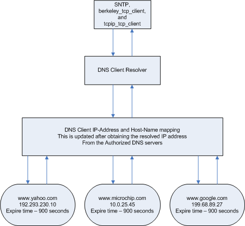
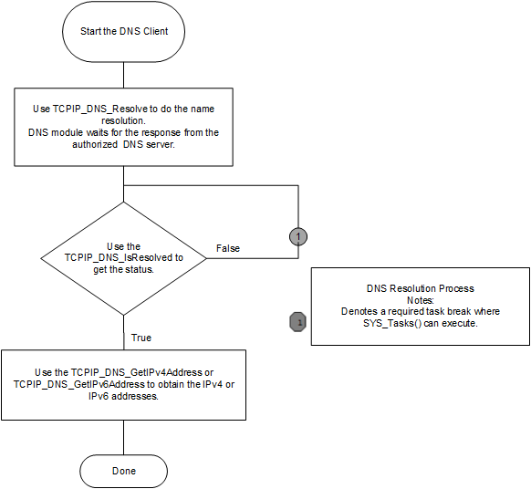

# DNS Module

The Domain Name Service associates host names \(i.e., www.microchip.com\) with IP addresses \(i.e., 10.0.54.2\). The DNS Client module provides DNS resolution capabilities to the stack. As illustrated in the figure, a typical resolution process is as follows:

-   The DNS Client, also known as the DNS Resolver, will try to resolve the IP address from its local resources, which includes the Name to Address mappings in the local DNS cache. DNS clients are capable of caching the previous DNS query results and this module supports a maximum number of cached entries configured with the DNS\_CLIENT\_CACHE\_ENTRIES parameter. Each cache entry is capable of storing the maximum number of IPv4 and IPv6 address, which is configured using the DNS\_CLIENT\_CACHE\_PER\_IPV4\_ADDRESS and DNS\_CLIENT\_CACHE\_PER\_IPV6\_ADDRESS parameters. The DNS resolver will use these available local resources and if it cannot find the IP Address corresponding to the requested DNS Record type, it will then query a DNS server for the IP Address.

-   The DNS server will directly answer the query if it is the authoritative server for the particular domain \(ex.: www.microchip.com\); otherwise, it will check its local cache of the previous queries. If it cannot find the IP Address, it will then query the DNS servers on the Internet.

-   Next, the DNS Server will query one of the root servers requesting a list of Authoritative servers for the .COM domain. The Root server will respond with the list of servers addresses hosting the .COM domain.

-   The Authoritative DNS server will then respond with the IP Address or a list of IP Address \(if more than one server hosts the website www.microchip.com\) for www.microchip.com.

-   The address that the DNS server returns back to the DNS client is then passed to the DNS application, which initially requested the IP Address information.

-   DNS resolver clients are both internal stack modules \(SNTP, for example\), as well as applications using the TCP/IP stack.

**Abstraction Model**

DNS is part of the Application Layer. Following is a description of how the DNS Client works and how it should be used.

-   By default, the DNS client is enabled and included in the TCP/IP stackbuild.

-   The DNS Client module will use a UDP socket on port number 53 to contact the DNS server.

-   The DNS client can be enabled/disabled dynamically at run time.

-   When the TCP/IP commands module is built in the stack, commands for manipulation of the DNS module are available:

    -   The DNS module can be enabled using the command "dns eth0 on".

    -   The DNS client module can be disabled from the command prompt using "dns eth0 off".

    -   In the above examples the first Ethernet interface is used. Any valid network interface can be used.

-   Applications or demonstrations such as berkeley\_tcp\_client, berkeley\_udp\_client, tcpip\_tcp\_client, and tcpip\_udp\_client, use the TCPIP\_DNS\_Resolve function with Host name and Record type as arguments to resolve the domain host name. The DNS module supports the Record type of "A" for IPv4 addresses and "AAAA" for IPv6.

-   The resolved domain name and the mapped IPv4 or IPv6 address will be stored in a table with the expiration time, which is calculated from the DNS server response.

-   The server supplied IPv4 and IPv6 addresses will be cached internally \(see the DNS\_CLIENT\_CACHE\_PER\_IPV4\_ADDRESS and DNS\_CLIENT\_CACHE\_PER\_IPV6\_ADDRESS parameters\).

-   The TCPIP\_DNS\_IsResolved function will return DNS\_RES\_OK if the domain name resolve is successful.

-   The TCPIP\_DNS\_GetNumberOfIPAddresses function can be used to obtain the number of the IPv4 or IPv6 addresses present in the DNS Resolver tables.

-   The DNS Resolver table \(cache\) stores the dcorresponding name, the IP address and the expiration time returned by the server.

-   The functions, TCPIP\_DNS\_GetIPv4Address and TCPIP\_DNS\_GetIPv6Address, can be used to obtain the IPv4 or Ipv6 addresses for a resolved name entry.

**Library Interface**

|Name|Description|
|----|-----------|
|**General Functions**||
|TCPIP\_DNS\_HandlerDeRegister|Deregisters a previously registered DNS client handler.|
|TCPIP\_DNS\_HandlerRegister|Registers a DNS client Handler.|
|TCPIP\_DNS\_IsEnabled|Determines if the DNS client is enabled on that specified interface.|
|TCPIP\_DNS\_ClientInfoGet|Get the current DNS client parameters.|
|TCPIP\_DNS\_ClientTask|Standard TCP/IP stack module task function.|
|TCPIP\_DNS\_Disable|Disables the DNS Client for the specified interface.|
|TCPIP\_DNS\_Enable|Enables the DNS Client for the specified interface.|
|TCPIP\_DNS\_EntryQuery|Queries a DNS Resolver specific entry.|
|TCPIP\_DNS\_GetIPAddressesNumber|Get the count of resolved IPv4 and/or IPv6 address for a host name.|
|TCPIP\_DNS\_GetIPv4Addresses|Get IPV4 addresses for a DNS resolved name.|
|TCPIP\_DNS\_GetIPv6Addresses|Get IPV6 addresses for a DNS resolved name.|
|TCPIP\_DNS\_IsNameResolved|Determines if the DNS resolution is complete and provides the host IP address.|
|TCPIP\_DNS\_IsResolved|Determines if the DNS resolution is complete and provides the host IP address.|
|TCPIP\_DNS\_RemoveAll|Removes all the cached entries from DNS resolver.|
|TCPIP\_DNS\_RemoveEntry|Remove a hostname from the DNS Hash entry.|
|TCPIP\_DNS\_Resolve|Begins resolution of an address.|
|TCPIP\_DNS\_Send\_Query|Forces resolution of an address.|
|**Data Types and Constants**||
|TCPIP\_DNS\_EVENT\_HANDLER|Notification handler that can be called when a specific entry is resolved and entry is timed out.|
|TCPIP\_DNS\_EVENT\_TYPE|This enumeration is used to notify DNS client applications.|
|TCPIP\_DNS\_HANDLE|DNS client handle.|
|TCPIP\_DNS\_RESULT|DNS client result codes.|
|TCPIP\_DNS\_CLIENT\_INFO|General DNS client info.|
|TCPIP\_DNS\_CLIENT\_MODULE\_CONFIG|Provides a place holder for DNS client configuration.|
|TCPIP\_DNS\_ENABLE\_FLAGS|Flags for enabling the DNS service on an interface.|
|TCPIP\_DNS\_ENTRY\_QUERY|DNS module query data for both IPv4 and IPv6 .|
|TCPIP\_DNS\_RESOLVE\_TYPE|DNS query record type.|
|TCPIP\_DNS\_CLIENT\_ADDRESS\_TYPE|This parameter can be used to choose ithe type of IP connection for the DNS client: IPv4 or IPv6. Currently only IPv4 is supported and this parameter is not used. Reserved for future development|
|TCPIP\_DNS\_CLIENT\_CACHE\_DEFAULT\_TTL\_VAL|Default TTL time for a solved entry in the cache This value will be used when the DNS server TTL value for an entry is 0|
|TCPIP\_DNS\_CLIENT\_CACHE\_ENTRIES|Number of DNS resolver entries|
|TCPIP\_DNS\_CLIENT\_CACHE\_ENTRY\_TMO|DNS client cache entry time-out. If this symbol is zero then the entry time-out will be the one specified by the DNS server when the name was solved. Otherwise this value will be used as the cache entry time-out. Default should be 0.|
|TCPIP\_DNS\_CLIENT\_CACHE\_PER\_IPV4\_ADDRESS|Maximum and default number of IPv4 answers to be considered while processing DNS response from server for a query.|
|TCPIP\_DNS\_CLIENT\_CACHE\_PER\_IPV6\_ADDRESS|Maximum and default number of IPv6 answers to be considered while processing DNS response from server for a query.|
|TCPIP\_DNS\_CLIENT\_CACHE\_UNSOLVED\_ENTRY\_TMO|Time-out for the a unsolved name, in seconds. The name resolution will be aborted if the TMO elapsed and the name could not be solved Should be greater than TCPIP\_DNS\_CLIENT\_LOOKUP\_RETRY\_TMO|
|TCPIP\_DNS\_CLIENT\_LOOKUP\_RETRY\_TMO|Retry lookup for a unsolved entry in the cache, in seconds. If the TCPIP\_DNS\_CLIENT\_LOOKUP\_RETRY\_TMO seconds elapsed and the name has not been solved then the name entry will be marked with server timeout and the resolution will be retried. Should be less than TCPIP\_DNS\_CLIENT\_CACHE\_UNSOLVED\_ENTRY\_TMO|
|TCPIP\_DNS\_CLIENT\_MAX\_HOSTNAME\_LEN|Max DNS host name size Use an appropriate value, depending on the names that need to be solved|
|TCPIP\_DNS\_CLIENT\_MAX\_SELECT\_INTERFACES|Max number of interfaces to take part in the DNS selection algorithm Should be always greater than 1:|
|the|default interface should always be considered for DNS resolution|
|Depending|on how many active interfaces select those to be considered for DNS resolution|
|TCPIP\_DNS\_CLIENT\_SERVER\_TMO|When the DNS Client connected to the DNS Server this is the elapsed time after which an the communication is considered to have timed failed if there was no reply from the server In seconds|
|TCPIP\_DNS\_CLIENT\_TASK\_PROCESS\_RATE|DNS Client task processing rate, in milliseconds. The DNS Client module will process a timer event with this rate for processing its own state machine, etc. The default value is 200 milliseconds. The lower the rate \(higher the frequency\) the higher the module priority and higher module performance can be obtained The value cannot be lower than the TCPIP\_STACK\_TICK\_RATE.|
|TCPIP\_DNS\_CLIENT\_USER\_NOTIFICATION|allow DNS client user notification if enabled, the TCPIP\_DNS\_HandlerRegister/TCPIP\_DNS\_HandlerDeRegister functions exist and can be used|

-   **[TCPIP\_DNS\_CLIENT\_ADDRESS\_TYPE Macro](GUID-0E27BF3F-0F22-406F-B8BF-A06BB82B0681.md)**  

-   **[TCPIP\_DNS\_CLIENT\_CACHE\_DEFAULT\_TTL\_VAL Macro](GUID-6CEFB266-0BD0-4C0E-AD2C-D054CA502682.md)**  

-   **[TCPIP\_DNS\_CLIENT\_CACHE\_ENTRIES Macro](GUID-A02509EB-5D47-4F15-9624-DF4B347C58F2.md)**  

-   **[TCPIP\_DNS\_CLIENT\_CACHE\_ENTRY\_TMO Macro](GUID-CD63EC26-3D34-4898-901D-90B16F42BA0E.md)**  

-   **[TCPIP\_DNS\_CLIENT\_CACHE\_PER\_IPV4\_ADDRESS Macro](GUID-32CEAFDF-9937-4EAA-80F8-4582953EB286.md)**  

-   **[TCPIP\_DNS\_CLIENT\_CACHE\_PER\_IPV6\_ADDRESS Macro](GUID-4CC6E754-D7DA-499C-81A5-20DEFFB63D25.md)**  

-   **[TCPIP\_DNS\_CLIENT\_CACHE\_UNSOLVED\_ENTRY\_TMO Macro](GUID-FDCC89BA-55AA-441D-B734-CB3EA482EDE4.md)**  

-   **[TCPIP\_DNS\_CLIENT\_INFO Structure](GUID-8E122275-7175-409E-920E-1C72D335CEEF.md)**  

-   **[TCPIP\_DNS\_CLIENT\_LOOKUP\_RETRY\_TMO Macro](GUID-608D53C9-C51D-405E-8113-C8B2AA011198.md)**  

-   **[TCPIP\_DNS\_CLIENT\_MAX\_HOSTNAME\_LEN Macro](GUID-0E293EBD-6A94-44B6-9917-EBA8F444F9DF.md)**  

-   **[TCPIP\_DNS\_CLIENT\_MAX\_SELECT\_INTERFACES Macro](GUID-9EA99835-9E73-4F37-A1CB-D6E0B063F7E9.md)**  

-   **[TCPIP\_DNS\_CLIENT\_MODULE\_CONFIG Structure](GUID-4D261A34-344C-4CF2-8AF9-3C32257BA720.md)**  

-   **[TCPIP\_DNS\_CLIENT\_SERVER\_TMO Macro](GUID-4E3E9377-68EA-48AA-98EB-46D8991416A5.md)**  

-   **[TCPIP\_DNS\_CLIENT\_TASK\_PROCESS\_RATE Macro](GUID-B1D8044C-E1A5-4436-8E8E-38D34314BE07.md)**  

-   **[TCPIP\_DNS\_CLIENT\_USER\_NOTIFICATION Macro](GUID-18AFB3BA-C9CD-4F3A-ADCA-2B80AFE88533.md)**  

-   **[TCPIP\_DNS\_ClientInfoGet Function](GUID-35E80DC1-C40F-40AE-88AB-4316ADEF228A.md)**  

-   **[TCPIP\_DNS\_ClientTask Function](GUID-ADB87FB8-A110-467D-9863-27F5B113A7C2.md)**  

-   **[TCPIP\_DNS\_Disable Function](GUID-4642776A-7413-4A77-9C0C-9A2E5789B1BE.md)**  

-   **[TCPIP\_DNS\_Enable Function](GUID-20C3F443-5880-4DC7-BC60-D32CC338D577.md)**  

-   **[TCPIP\_DNS\_ENABLE\_FLAGS Enumeration](GUID-2B48A7AD-86F6-4711-93E4-E9A1118EDFC0.md)**  

-   **[TCPIP\_DNS\_ENTRY\_QUERY Structure](GUID-7820ED03-0BDB-4786-AB0E-75F76144F569.md)**  

-   **[TCPIP\_DNS\_EntryQuery Function](GUID-25CE1982-3A3C-4B85-9E3D-AA4B7E4B6FB4.md)**  

-   **[TCPIP\_DNS\_EVENT\_HANDLER Type](GUID-4C6B8A89-9CD3-4698-BF46-0AD17288090B.md)**  

-   **[TCPIP\_DNS\_EVENT\_TYPE Enumeration](GUID-8C9E82DC-7C04-4972-8DBD-089F22E171B0.md)**  

-   **[TCPIP\_DNS\_GetIPAddressesNumber Function](GUID-AD5DAF5B-5EA9-4CA5-92A2-2AD3E1473A93.md)**  

-   **[TCPIP\_DNS\_GetIPv4Addresses Function](GUID-58077ADE-51A1-4E08-B1F4-BF617D2F3518.md)**  

-   **[TCPIP\_DNS\_GetIPv6Addresses Function](GUID-4DF2541D-DF50-45F1-A4E8-1233E5161579.md)**  

-   **[TCPIP\_DNS\_HANDLE Type](GUID-AAA58362-D612-464F-940A-A03BDA302B48.md)**  

-   **[TCPIP\_DNS\_HandlerDeRegister Function](GUID-D059B873-04CB-4F6C-B2D7-2D87A82824D6.md)**  

-   **[TCPIP\_DNS\_HandlerRegister Function](GUID-610DA949-0CAF-4DC7-AA73-F73300E87110.md)**  

-   **[TCPIP\_DNS\_IsEnabled Function](GUID-47111128-D371-4827-B15C-7E852623495C.md)**  

-   **[TCPIP\_DNS\_IsNameResolved Function](GUID-4E898CC0-B8B1-4130-9FC4-86CBA68A57C1.md)**  

-   **[TCPIP\_DNS\_IsResolved Function](GUID-4B19C888-F3A6-4680-8508-BBC4BA473F08.md)**  

-   **[TCPIP\_DNS\_RemoveAll Function](GUID-669AB372-B432-43BD-9DF2-76C13A93F1CD.md)**  

-   **[TCPIP\_DNS\_RemoveEntry Function](GUID-6CBFB260-A020-4046-9311-CA8D9CB62FC8.md)**  

-   **[TCPIP\_DNS\_Resolve Function](GUID-46C3BA25-A36F-4BA7-82B4-19DB6A5DAC82.md)**  

-   **[TCPIP\_DNS\_RESOLVE\_TYPE Enumeration](GUID-C3770C12-D928-4ACF-97E7-B80D6EB08DCE.md)**  

-   **[TCPIP\_DNS\_RESULT Enumeration](GUID-9A3C3F1A-4F48-40BD-B84C-C6EF22144F74.md)**  

-   **[TCPIP\_DNS\_Send\_Query Function](GUID-3D0BA10F-4BC9-4755-9042-7B7A1861E748.md)**  

**Parent topic:**[MPLAB® Harmony TCP/IP Library](GUID-01A0A1D8-EC9B-4EFF-B8E4-D154B555FEF2.md)

