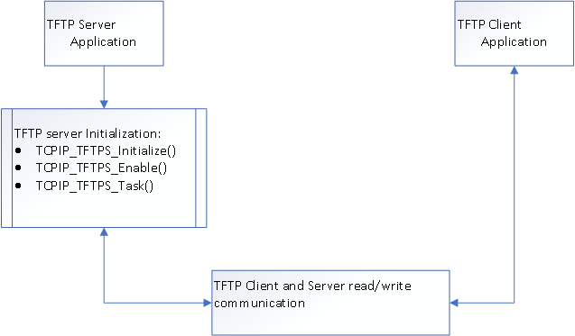
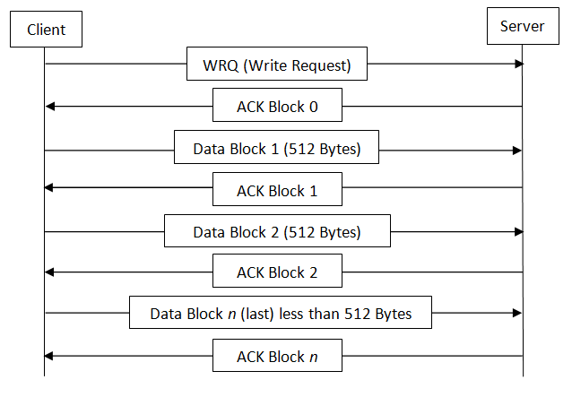
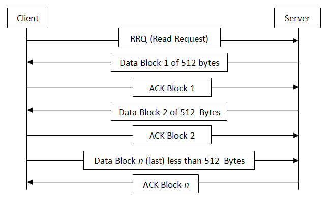
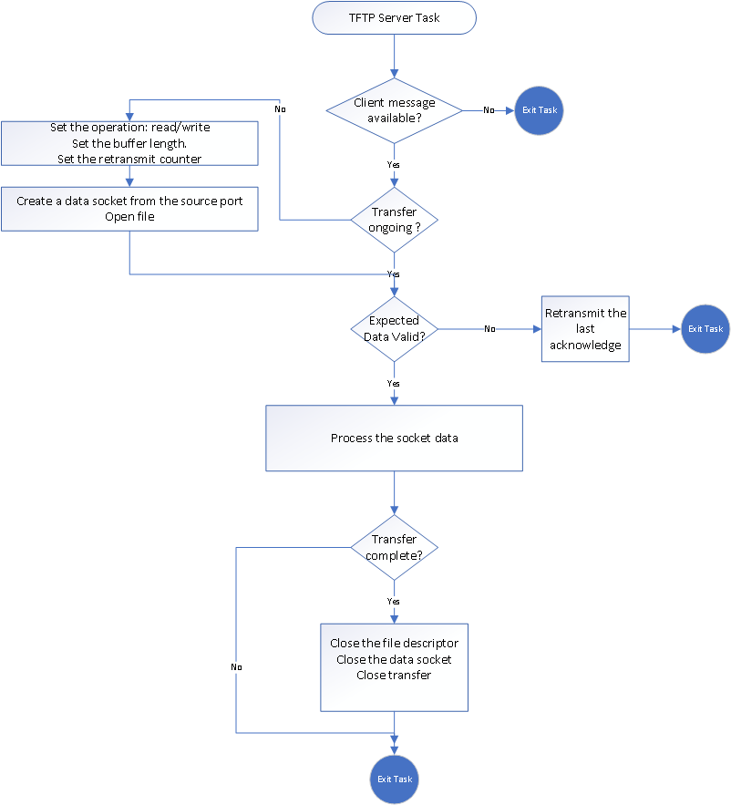

# TFTP Server Module

The TCP/IP Stack Library Trivial File Transfer Protocol \(TFTP\) module is a simple protocol used to transfer files.

The TFTP server waits for client requests to read and write files.

**Abstraction Model**

The TFTP communication is based on a client/server model. The process of transferring a file consists of three main phases. In highly generalized terms, these phases are:

-   Initial Connection:

    -   The TFTP client establishes the connection by sending an initial request to the server.

    -   The server responds back to the client and the connection is effectively opened.

-   Data Transfer:

    -   Once the connection has been established, the client and server exchange TFTP messages. One device sends data and the other sends acknowledgments.

-   Connection Termination:

    -   When the last TFTP message containing data has been sent and acknowledged, the connection is terminated.

**How the Library Works**

Any transfer begins with a request from a client to read or write a file. If the server grants the request, the connection is opened and the file is sent usually in fixed length blocks of 512 bytes. Each data packet contains one block of data, and must be acknowledged by an acknowledgment packet before the next packet can be sent. A data packet of less than 512 bytes, signals termination of a transfer. If a packet gets lost in the network, the intended recipient will time out and may retransmit the last packet \(which may be data or an acknowledgment\), thus causing the sender of the lost packet to retransmit that lost packet.

*TFTP Transfer Set up*

-   To set up a TFTP transfer, a TFTP client device can request \(get\) files from the server and also transfer \(put\) files to the server.

-   The File System on the server is transparent. Currently the Microchip Harmony devices support MPFS or FAT file systems.

-   The Microchip TFTP server implementation allows the user to start and stop the service dynamically by using the TFTP Application Programming Interface \( API\) function.

*TFTP Transfer Options*

The following options are supported in the current TFTP server implementation \(see RFC 2348, 2349\):

|TFTP Option Name|TFTP Option Code \(Used in Request Messages\)|Description|
|----------------|---------------------------------------------|-----------|
|Block Size|blksize|The option allows the Client and the Server to send data blocks of a size different than 512 bytes|
|Timeout Interval|interval|The option permits the client /server to agree on a specified number of seconds to use for their retransmission.|
|Transfer Size|tsize|The option allows the side receiving the file to determine the ultimate size of the transfer before it begins.|

**TFTP Client Server Communication**

*TFTP Write Request \(WRQ\)*

The following diagram illustrates a write request

*TFTP Read Request \(RRQ\)*

The following diagram illustrates a read request

*Flow chart for the TFTP server processing incoming requests*

**Library Interface**

|Name|Description|
|----|-----------|
|**Macros**||
|TCPIP\_TFTPS\_CLIENT\_NUMBER|The number of Clients requests will be processed for the TFTP server stack.|
|TCPIP\_TFTPS\_DEFAULT\_BLOCK\_SIZE|The maximum value for the file name size. Even though the RFC allows blocks of up to 65464 bytes, In practice the limit is set to 1468 bytes: the size of an Ethernet MTU minus the headers of TFTP \(4 bytes\), UDP \(8 bytes\) and IP \(20 bytes\)|
|TCPIP\_TFTPS\_DEFAULT\_FILESIZE|The maximum size for a file in bytes to be accepted.TFTP Opcode defined by RFC 2347.|
|TCPIP\_TFTPS\_DEFAULT\_TIMEOUT|This time is used during the TFTP retransmission and TFTP Client wait for these many seconds before retransmitting .|
|TCPIP\_TFTPS\_RETRANSMIT\_COUNT|The number of attempts to retransmit the previous packet before declaring a TIMEOUT error.|
|TCPIP\_TFTPS\_TASK\_TICK\_RATE|The TFTP server task rate in milliseconds. The default value is 100 milliseconds. The lower the rate \(higher the frequency\) the higher the module priority and higher module performance can be obtained The value cannot be lower than the TCPIP\_STACK\_TICK\_RATE.|
|TCPIP\_TFTPS\_FILENAME\_LEN|The default length of the file name is defined to 64 bytes.|
|TCPIP\_TFTPS\_USER\_NOTIFICATION|allow TFTP Server user notification if enabled, the TCPIP\_TFTPS\_HandlerRegister/TCPIP\_TFTPS\_HandlerDeRegister functions exist and can be used|
|**Functions**||
|TCPIP\_TFTPS\_ClientsNumber|Determines the number of clients running for this server.|
|TCPIP\_TFTPS\_Disable|Disables the TFTP server for the specified interface.|
|TCPIP\_TFTPS\_Enable|Enables the TFTP server for the specified interface.|
|TCPIP\_TFTPS\_HandlerDeRegister|De-registers a previously registered TFTP Server handler.|
|TCPIP\_TFTPS\_HandlerRegister|Registers a TFTP Server Handler.|
|TCPIP\_TFTPS\_IsEnabled|Determines if a TFTP server is active or not.|
|TCPIP\_TFTPS\_Task|Standard TCP/IP stack module task function.|
|**Data Types and Constants**||
|TCPIP\_TFTPS\_EVENT\_TYPE|List of events for the TFTPS module.|
|TCPIP\_TFTPS\_RESULT|Provides a list of possible results for the TFTPS module.|
|TCPIP\_TFTPS\_MODULE\_CONFIG|Placeholder for TFTPS Module Configuration|
|TCPIP\_TFTPS\_EVENT\_HANDLER|Notification handler that can be called when there is a TFTP process for a client.|
|TCPIP\_TFTPS\_HANDLE|TFTP server handle.|

-   **[TCPIP\_TFTPS\_CLIENT\_NUMBER Macro](GUID-4F773C2C-C548-4F4B-841F-2C2C5900FBDF.md)**  

-   **[TCPIP\_TFTPS\_ClientsNumber Function](GUID-39087128-B789-43C2-9051-FF6B16C602D8.md)**  

-   **[TCPIP\_TFTPS\_DEFAULT\_BLOCK\_SIZE Macro](GUID-696B5441-B8C4-4CC1-BCCC-A0BF436D411C.md)**  

-   **[TCPIP\_TFTPS\_DEFAULT\_FILESIZE Macro](GUID-05688223-4365-4430-8F45-21B54F07FFB5.md)**  

-   **[TCPIP\_TFTPS\_DEFAULT\_TIMEOUT Macro](GUID-7DA9A0EF-BA77-4B60-A11F-B908DEAD1BE7.md)**  

-   **[TCPIP\_TFTPS\_Disable Function](GUID-B6CFE3F9-30F7-4067-B4FD-735253EC028E.md)**  

-   **[TCPIP\_TFTPS\_Enable Function](GUID-7CCB132F-5845-4C15-AB31-EECB0F5A5723.md)**  

-   **[TCPIP\_TFTPS\_EVENT\_HANDLER Type](GUID-0924570F-F980-46E8-AC04-3891920C141E.md)**  

-   **[TCPIP\_TFTPS\_EVENT\_TYPE Enumeration](GUID-4FB260C5-55E6-4E39-85B4-DD70BB05B922.md)**  

-   **[TCPIP\_TFTPS\_FILENAME\_LEN Macro](GUID-52D042FB-F60D-4A4F-94A4-103128DEF604.md)**  

-   **[TCPIP\_TFTPS\_HANDLE Type](GUID-A4D852FB-4A68-4096-8395-1AA3B2DC9FAA.md)**  

-   **[TCPIP\_TFTPS\_HandlerDeRegister Function](GUID-00731900-7B6C-42F1-A7BD-F9F7450D3600.md)**  

-   **[TCPIP\_TFTPS\_HandlerRegister Function](GUID-60DFB271-66B4-4042-9D04-C8BA5BFBF391.md)**  

-   **[TCPIP\_TFTPS\_IsEnabled Function](GUID-A2F2FCBB-C950-48DE-953A-1042AE6F5FB3.md)**  

-   **[TCPIP\_TFTPS\_MODULE\_CONFIG Structure](GUID-34F80898-63A3-46F7-B5EC-669CC0A89DAE.md)**  

-   **[TCPIP\_TFTPS\_RESULT Enumeration](GUID-612707E0-4C71-40F1-B820-B44CFC4A2573.md)**  

-   **[TCPIP\_TFTPS\_RETRANSMIT\_COUNT Macro](GUID-78138D90-0366-4702-91C7-86ADDC7DCC13.md)**  

-   **[TCPIP\_TFTPS\_Task Function](GUID-9BD25F40-82F5-447B-AED0-BD21FC7D0681.md)**  

-   **[TCPIP\_TFTPS\_TASK\_TICK\_RATE Macro](GUID-E36D97BD-C847-4199-95DA-E0AF04A11C0D.md)**  

-   **[TCPIP\_TFTPS\_USER\_NOTIFICATION Macro](GUID-B37F9580-01DC-4D9C-862B-D001EE912110.md)**  

**Parent topic:**[MPLAB® Harmony TCP/IP Library](GUID-01A0A1D8-EC9B-4EFF-B8E4-D154B555FEF2.md)

